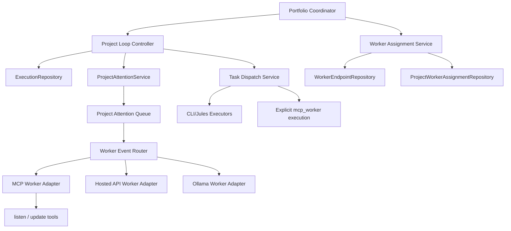

# Multi-Project Agentic Refactor Plan

## Status
In Progress

## Implementation Snapshot

Completed on March 12, 2026:

- replaced the single-document settings repository with scoped sqlite storage:
  - `system_settings`
  - `project_settings`
  - `sprint_settings`
- added typed scoped settings contracts and server-side resolution:
  - `SystemSettings`
  - `ProjectSettings`
  - `ProjectSettingsOverride`
  - `SprintSettingsOverride`
  - effective settings with per-field source metadata
- cut the dashboard HTTP surface over to scoped settings endpoints:
  - `/api/system-settings`
  - `/api/projects/:projectId/settings`
  - `/api/projects/:projectId/settings/effective`
  - `/api/sprints/:sprintId/settings`
  - `/api/projects/:projectId/sprints/:sprintId/settings/effective`
- removed the runtime legacy dashboard fallback route from the active Preact entrypoint
- added integration coverage for the scoped settings API and resolution path
- replaced the v2 `/config` draft with a real scoped settings UI for:
  - system runtime, integrations, default project behavior, and MCP tools
  - selected-project effective settings with inherited-source metadata
- added a live sprint override modal on the sprint page backed by the sprint effective-settings API
- changed project override persistence to diff against current system defaults so the UI can safely save effective project forms without snapshotting inherited values
- taught the MCP worker dispatch path to prefer sticky project affinity:
  - a worker listening across multiple active projects now checks its own recent worker dispatch history first
  - active or most-recently-seen projects are claimed before unrelated projects
  - explicit `projectId` worker pulls still stay project-specific and bypass affinity reordering
- introduced the first worker endpoint abstraction layer:
  - added `worker_endpoints` as a transport-neutral worker table
  - synchronized MCP worker registrations into worker endpoint rows
  - worker task dispatch claims now require a worker endpoint with task-execution capability
- added explicit project-worker assignments:
  - `project_worker_assignments` now persist sticky worker ownership per project
  - active worker task claims refresh assignment affinity
  - execution snapshots now expose primary vs overflow assigned workers
- introduced the first structured attention queue:
  - `project_attention_items` now persist worker-oriented supervision items
  - worker lease expiry, stale cancel timeouts, worker-blocked dispatches, merge-required tasks, blocked action-required tasks, and watch-loop manual-attention pauses open attention items
  - dispatch retry resolves active dispatch-scoped attention items
  - sprint cycles resolve stale merge/action/manual attention items when the blocker clears
  - execution snapshots now expose active project attention items
  - worker and dashboard flows can now claim, resolve, and dismiss active attention items
  - the v2 runtime page now shows the project attention queue with direct operator controls
- upgraded the worker listen loop foundation:
  - `listen` and `start_listen` now accept `project_ids` and `active_project_ids`
  - worker listeners now receive `assignment_changed` and `attention_item` events
  - worker supervision events now include `repoPath`, `workingDirectoryHint`, and a lightweight `contextDigest`
  - the in-repo worker now auto-claims open worker-owned attention items and keeps active project supervision state locally
  - worker supervision no longer stalls at claim time:
    - workers can now report `handled_locally`, `needs_dashboard_reply`, or `needs_human_escalation`
    - operator-required outcomes create a real project thread with a system handoff message
    - the original worker-owned item resolves and, when needed, a human-owned handoff queue item opens

Still pending from the broader refactor:

- portfolio coordinator and project-loop controller split
- worker endpoint abstraction beyond MCP connections
- richer reassignment policy and deeper worker-side handling after delivery
- settings search, override filters, and deeper per-field reset UX

## Purpose and Scope

This document defines the refactor plan for moving Code UX from a single-project, single-loop orchestration model to a multi-project orchestration system with sticky worker supervision.

The target behavior is:

- multiple projects can run orchestration concurrently
- each project keeps its own repo path, sprint state, leases, and runtime events
- connected workers are used only for non-automatable supervision work by default
- workers stay idle when no attention is required
- if workers are available, prefer one worker per project
- if workers are scarce, allow one worker to cover multiple projects without losing project affinity
- the design supports future non-MCP workers such as hosted API-backed models and Ollama-backed workers

This plan is based on the current implementation in:

- `src/sprint/sprint-orchestrator.ts`
- `src/domain/sprint/orchestrator/*`
- `src/services/sprint-execution-state-service.ts`
- `src/services/sprint-task-dispatch-service.ts`
- `src/services/worker-task-dispatch-service.ts`
- `src/services/worker-dispatch-execution-service.ts`
- `src/repositories/project-management-repository.ts`
- `src/repositories/project-runtime-repository.ts`
- `src/repositories/execution-repository.ts`
- `src/repositories/connection-chat-repository.ts`
- `src/server/jules-agent-server.ts`
- `src/worker/code-ux-worker.ts`

## Current-State Findings

### What is already in place

- The planning model is already DB-native through `projects`, `sprints`, `tasks`, and `task_dependencies`.
- Execution is already partially DB-native through `sprint_runs`, `task_dispatches`, `task_runs`, `task_run_events`, and `execution_leases`.
- Workers already exist as real MCP connections and can claim `mcp_worker` dispatches.
- Dispatch payloads already include `repoPath`, `defaultBranch`, and `featureBranch`.
- The dashboard and runtime model already understand project-scoped execution data.

### Where the current design is still single-project biased

1. `SprintOrchestrator.execute(...)` resolves exactly one `SprintExecutionContext` and one `repoPath` for the entire call.
2. `RuntimeContext.lastStatus` is still process-global even though runtime projection is now project-scoped in sqlite.
3. `ConnectionChatRepository.startListen(...)` binds a listener to one project per listen registration.
4. `CoreToolHandler.handleListenForRuntime(...)` only passes one `project_id` into worker dispatch claiming.
5. `ExecutionRepository.claimNextTaskDispatch(...)` is project-local FIFO and does not know about worker affinity, load, or project stickiness.
6. `WorkerTaskDispatchService` treats workers mainly as dispatch executors, not as project supervisors for escalations.
7. `mcp_connections` only model live MCP clients; they cannot represent future hosted API or Ollama workers.
8. Several flows still fall back to selected project or `process.cwd()`, which is unsafe for autonomous multi-project operation.

### Product-model gap

Today, unresolved work such as merge issues, stalled CI, blocked sessions, and manual intervention mainly appears as report text and dashboard state. There is no first-class supervision queue that can be assigned to a worker and handled independently from normal task execution.

That is the main missing layer for the system you described.

### Settings-model gap

The current settings model is still one global `DashboardSettings` document stored through `SettingsRepository` in `~/.code-ux/settings.db`.

That is now structurally wrong for the target product because:

- many runtime settings should vary by project
- some of those settings should be overridable for one sprint only
- secrets and system runtime knobs should remain system-wide
- the current draft v2 settings UI does not reflect the real persisted settings model yet

The settings refactor must therefore be part of the main architecture plan, not a separate UI cleanup.

From the current implementation, there are also deeper technical issues to correct:

- settings persistence is still a single JSON blob with no scoped reads or writes
- the dashboard API only exposes global `GET /api/settings` and `PUT /api/settings`
- frontend defaults and update logic duplicate backend rules
- field descriptors exist in the UI, but they are not the system source of truth
- settings side effects such as Git skill synchronization are encoded as special-case updater logic rather than declarative rules
- there is no first-class "effective settings" explanation showing inherited vs overridden values
- there is no audit trail or version history for impactful settings changes

## Design Principles

1. Automation first. Normal sprint progress must not require a connected worker.
2. Project-scoped runtime. Every orchestration decision must be tied to an explicit `projectId`, `sprintId`, and `repoPath`.
3. Sticky supervision. Keep the same worker on the same project whenever possible.
4. Overflow, not churn. Multi-project worker coverage is a fallback mode, not the default.
5. Transport-independent workers. MCP workers are one adapter, not the domain model.
6. Separate supervision from execution. A worker can supervise a project without being the primary executor for normal coding tasks.
7. DB is the source of truth. No new control plane should be built in process memory only.
8. Direct cutover over compatibility layers. Replace the old single-scope settings/runtime flow instead of adding new bridge APIs or dashboard fallbacks.
9. Settings inheritance must be explicit. Effective runtime settings must always resolve from `system -> project -> sprint`.
10. UI organization must follow the real settings schema. The new settings dashboard should be generated from the settings catalog, not from disconnected draft categories.

## Target Architecture



### Core runtime slices

#### 1. Portfolio Coordinator

A new server-side coordinator owns the multi-project main loop.

Responsibilities:

- discover which projects and sprints are eligible for orchestration
- start or resume one `ProjectLoopController` per active project/sprint
- enforce global concurrency limits
- never confuse one project's repo path, events, or leases with another's

This becomes the new "main orchestration loop". The existing `SprintOrchestrator` remains as the project-scoped primitive.

#### 2. Project Loop Controller

Each project loop is a refactoring of the current single-sprint watch loop into an isolated controller with:

- explicit `projectId`
- explicit `sprintId`
- explicit `repoPath`
- explicit `sprintRunId`
- project-local lease ownership
- zero dependency on selected-project globals

The current `CycleRunner` and `WatchLoopRunner` logic should move behind this controller with minimal behavior change first.

#### 3. Worker Endpoint Layer

Introduce a transport-agnostic worker model.

Workers should no longer be represented only as `mcp_connections`. Instead:

- `mcp_connections` remain live transport/session records
- `worker_endpoints` become routable supervision/execution endpoints
- a worker endpoint may reference an MCP connection, a hosted API model, or an Ollama runtime

This is required to support future non-MCP workers without rewriting assignment and routing again.

#### 4. Project Supervision Layer

Workers are supervisory endpoints first.

Normal automated task execution continues through:

- `docker_cli`
- `jules`
- explicit `mcp_worker` only when a task is deliberately marked for worker execution

Worker supervision covers:

- merge conflicts
- merge-required checkpoints
- CI failures after autofix/retry policy is exhausted
- blocked sessions requiring interpretation or project-manager action
- lease-expired or disconnected worker recovery
- project chat / planning / operator instructions

#### 5. Attention Queue

Add a first-class queue for non-automatable project work.

This queue is separate from `task_dispatches` because these items are not normal coding executions. They are supervision events that can be:

- opened automatically by orchestration
- assigned to a worker if one is available
- left pending in the dashboard if no worker is assigned
- resolved without disturbing normal autonomous execution

## Key Domain Decisions

### Workers should be sticky supervisors, not always-on executors

This is the most important design choice in the whole refactor.

The system should not route every task through a worker just because a worker exists. That would:

- reduce autonomy
- create avoidable idle chatter
- make scale depend on active listeners
- mix exception handling with normal work execution

Instead:

- default coding work stays automated
- workers receive only supervision items and explicit worker-executor tasks
- a sprint must be able to finish with zero connected workers

### Keep `mcp_worker` but decouple it from project supervision

The current explicit `mcp_worker` dispatch path is still useful and should remain supported.

However, it must not define the whole worker product model anymore.

Internally, distinguish:

- `worker supervision capability`
- `worker task execution capability`

A worker endpoint may support one or both.

### Make repo context explicit everywhere

Every worker-facing or executor-facing payload must include:

- `projectId`
- `projectName`
- `repoPath`
- `defaultBranch`
- `featureBranch`
- `workingDirectoryHint`
- `contextDigest`

For MCP workers with local filesystem access, `workingDirectoryHint` is actionable.

For hosted API or Ollama workers, `repoPath` is metadata unless that worker is paired with an execution gateway.

## Data Model Changes

## Settings Hierarchy Refactor

## Target settings scope model

Code UX should move to three layers:

1. `SystemSettings`
2. `ProjectSettingsOverride`
3. `SprintSettingsOverride`

Runtime always resolves:

```text
effective sprint settings
  = sanitize(system settings)
  + project override
  + sprint override
  -> resolved execution settings
```

The current `DashboardSettings` shape should become the resolved settings contract used by execution services after inheritance is applied.

### Why this is the right model

- system settings keep true machine-wide and secret-bearing configuration in one place
- projects inherit sane defaults without duplicating secrets everywhere
- sprints can override only what actually needs temporary deviation
- the dashboard can show inherited values clearly instead of hiding implicit fallback rules

## Scope ownership by settings group

### System-wide only

These belong on the new system settings page in the main navigation:

- runtime and operations
  - `dashboardPort`
  - `enableDebugLogFile`
  - future server/network/runtime flags
- global integrations and secrets
  - provider API keys
  - GitHub token
  - future hosted AI credentials
  - future Ollama connection defaults
- global MCP/tool surface policy
  - `mcpTools`
- global UI/operator preferences
  - any future appearance or local-operator preferences

### Project-inheritable defaults

These should move from legacy global settings into per-project configuration with inheritance from system defaults:

- automation policy
  - `automationLevel`
  - `automationInterventions`
- AI routing and model selection
  - `aiProvider.provider`
  - `aiProvider.strategy`
  - `aiProvider.providers[*].enabled`
  - `aiProvider.providers[*].model`
  - `aiProvider.providers[*].weight`
  - `aiProvider.providers[*].thinkingMode`
- git and branch policy
  - `git.githubMode`
  - `git.defaultBranch`
  - `git.autoCreatePr`
  - `git.featureBranchPrefix`
  - `git.sprintBranchScheme`
- CI and merge policy
  - `ciIntelligence`
- sprint engine defaults
  - `sprintLoopSteps`
- execution/workspace behavior
  - `cliWorkflow`
- project-enabled skills
  - `skills`

### Sprint-level overrides

Sprint overrides should be sparse patch objects, not full copied settings documents.

Recommended sprint-overrideable groups:

- automation policy
- AI routing/model selection
- CI and merge policy
- sprint loop behavior
- selected execution-mode flags when a sprint genuinely needs a temporary deviation

Avoid free-form sprint overrides for:

- secrets
- MCP tool availability
- dashboard/server port
- debug log global behavior

### Secret handling

Secrets should not be copied into every project record by default.

Use this rule:

- system settings own secret values
- project settings may reference or opt into those integrations
- add project-local secret override support only where there is a real use case

This keeps the new settings model clean and avoids secret sprawl across project rows.

## Settings schema strategy

Do not hand-maintain three unrelated forms.

Introduce a settings catalog that describes:

- field path
- owning scope
- whether inheritance is allowed
- whether sprint override is allowed
- category/group
- secret vs non-secret
- validation rules
- UI control metadata

Suggested shape:

```ts
interface SettingDescriptor {
  path: string;
  label: string;
  category: "runtime" | "integrations" | "providers" | "git" | "ci" | "orchestration" | "execution" | "skills" | "tools";
  scope: "system" | "project";
  sprintOverrideable: boolean;
  secret: boolean;
}
```

This catalog should drive:

- validation
- sanitization
- inheritance resolution
- API contracts
- settings page rendering
- sprint override modal rendering
- secret redaction
- side-effect metadata
- dependency and visibility rules

That is the cleanest way to keep the tidy existing settings intact while migrating them into a new hierarchy.

## Additional settings improvements to make now

This refactor is a good time to fix settings architecture issues that are already present.

### 1. Make settings descriptor-driven end to end

Today, the frontend has field descriptors, but the backend validation and sanitization are separate handwritten logic.

Improve this by making one shared descriptor catalog define:

- field path
- type
- scope
- override policy
- default strategy
- secret handling
- visibility conditions
- dependency rules
- restart/reload impact

That reduces drift between:

- `settings-defaults.ts`
- `settings-sanitizer.ts`
- `settings-schema.ts`
- frontend field descriptors
- frontend updater helpers

### 2. Replace full-document writes with scoped patch APIs

Do not keep the future settings system on "load everything, mutate everything, save everything".

Add patch-oriented endpoints such as:

- `GET /api/system-settings`
- `PATCH /api/system-settings`
- `GET /api/projects/:projectId/settings`
- `PATCH /api/projects/:projectId/settings`
- `GET /api/sprints/:sprintId/settings`
- `PATCH /api/sprints/:sprintId/settings`
- `GET /api/projects/:projectId/settings/effective`
- `GET /api/sprints/:sprintId/settings/effective`

Benefits:

- lower risk of unrelated overwrites
- easier override reset behavior
- better future collaboration and concurrent editing

### 3. Add first-class effective-settings introspection

Operators need to understand why a value is what it is.

For every effective settings response, return metadata like:

- resolved value
- source scope (`system`, `project`, `sprint`)
- whether the field is overridden
- whether the field is secret-redacted

This should be visible in the dashboard UI.

### 4. Model dependencies declaratively

Current behavior already has dependencies such as:

- `githubMode` forcing the correct git-manager skill toggles

There will be more of these after the refactor.

Instead of scattering them across updater functions, put them in the settings rule layer so the system can explain:

- why another field changed
- why a field is disabled
- which overrides are invalid together

### 5. Add change-impact metadata

Some settings are harmless live toggles. Others affect active execution.

Each descriptor should declare impact such as:

- `live`
- `next_dispatch`
- `next_project_loop`
- `restart_required`

This lets the UI show precise warnings like:

- "Applies to new task dispatches only"
- "Requires loop restart"
- "Affects all projects immediately"

### 6. Add settings history and rollback

For system, project, and sprint scopes, persist change history:

- scope id
- changed fields
- actor
- timestamp
- before/after diff

This is high value for operational debugging and safe rollout of automation changes.

### 7. Add override hygiene rules

Sprint overrides should not become permanent clutter.

Recommended rules:

- track override count per sprint
- support "reset all sprint overrides"
- optionally suggest clearing overrides when a sprint is completed
- never copy inherited values into override payloads

### 8. Separate configuration from operator preferences

If future UI preferences are added, keep them out of runtime execution settings.

Examples:

- theme
- density
- dashboard layout

Those should not live in the same scope model as orchestration and execution policy.

### 9. Improve secret handling and display

The future settings system should support:

- redacted reads by default
- write-only updates for secrets
- optional per-project secret override only when explicitly enabled
- indication that a secret is inherited from system without exposing it

### 10. Add settings search and override filters in UI

As the catalog grows, operators will need:

- search by label/path
- filter by section
- filter by overridden only
- filter by scope ownership
- filter by non-default values

This is more useful than adding many more visual categories.

## Settings storage changes

Keep the current settings DB, but split storage into explicit scopes.

Recommended storage model:

- `system_settings`
  - one row containing system-wide settings payload
- `project_settings`
  - one row per project containing override payload only
- `sprint_settings`
  - one row per sprint containing override payload only

If reuse of `app_settings` is preferred for rollout speed, use namespaced keys first:

- `system_settings`
- `project_settings:<projectId>`
- `sprint_settings:<sprintId>`

and migrate to dedicated tables later if needed.

## Settings resolution service

Add a dedicated service:

- `SettingsResolutionService`

Responsibilities:

- read system settings
- overlay project settings
- overlay sprint settings
- resolve secrets safely
- sanitize the final result into the existing `DashboardSettings` runtime contract
- expose diff metadata so the UI can show inherited vs overridden values
- expose impact metadata so execution services know when changes take effect
- apply declarative dependency rules

### Important resolution rule

Do not snapshot system defaults into project settings at project creation time.

Projects should inherit live system defaults unless they explicitly override a field.

Otherwise the whole inheritance model will silently degrade back into copied configuration.

## Settings UI architecture

## Navigation model

### New System Settings page

Add a real system settings destination in the primary navigation, next to the dark/light switch as requested.

This page owns:

- runtime and server behavior
- integrations and secrets
- MCP tool surface
- global defaults that projects inherit from

### Project Settings page

The current legacy settings should be transitioned here, but reorganized around the new inheritance model.

This page should show:

- effective inherited value
- project override state
- reset-to-system action
- grouping by actual runtime concerns, not placeholder categories
- search, filter, and "show overridden only"
- change-impact messaging per field
- inherited-secret indicators without revealing secret values

### Sprint page override control

On the sprint page, add a lightweight override entry point.

Behavior:

- open modal or drawer from a clear "Overrides" action
- show only sprint-overrideable settings
- each field can be:
  - inherited from project
  - overridden for this sprint
- include explicit "Reset to project default"
- show "Changed for this sprint" badges
- support reset-all safely

This is the correct place for temporary deviations.

### Recommended UI affordances

Add these to the final settings experience:

- inheritance badges: `System`, `Project Override`, `Sprint Override`
- one-click reset per field
- scope diff summary before save
- unsaved changes guard
- validation grouped by section
- "copy effective value into override" action only where it adds real operator value

## Recommended information architecture

Replace the current draft category list with real grouped sections:

- Runtime
  - dashboard/runtime/server behavior
- Integrations
  - provider credentials, GitHub, future hosted AI, future Ollama
- Providers
  - model routing, provider enablement, thinking modes, weights
- Git and Branching
  - branch defaults, PR behavior, branch naming
- CI and Merge
  - CI gates, merge readiness, autofix policy
- Orchestration
  - automation level, interventions, sprint loop policy
- Execution
  - CLI workflow, Docker, workspace and execution mode
- Skills and Guides
  - project-enabled skills and future agent guidance toggles
- Tool Surface
  - MCP tool enablement and internal visibility

This is closer to the existing real settings than the current draft page and will scale cleanly as worker adapters are added.

## Migration rules for current settings

### Keep, do not drop

These existing settings are real runtime controls and should survive the migration:

- automation level and intervention toggles
- provider strategy and provider-level model config
- git behavior
- CI intelligence
- sprint loop steps
- CLI workflow
- skills
- MCP tool toggles

### Move, do not duplicate blindly

- move secrets and machine runtime values into system settings
- move project behavior into project settings
- move temporary deviations into sprint overrides

### Improve while migrating

- remove frontend/backend drift by centralizing the schema and descriptors
- replace full-document mutation with scoped patches
- add effective-settings API and override metadata
- add settings history instead of silent replacement writes
- normalize settings rules so side effects are explainable

### Avoid fake placeholder settings

Do not carry forward draft-only categories such as generic appearance or notifications unless they become real backed settings.

The new dashboard should prefer fewer real groups over more fake ones.

## New tables

### `worker_endpoints`

Represents routable worker-capable endpoints independent of transport.

Suggested fields:

- `id`
- `display_name`
- `endpoint_type` (`mcp_connection`, `hosted_api`, `ollama`)
- `provider_key`
- `backing_connection_id` nullable
- `status`
- `supports_supervision`
- `supports_task_execution`
- `supports_local_fs`
- `supports_project_chat`
- `max_active_projects`
- `max_active_dispatches`
- `capabilities_json`
- `last_heartbeat_at`
- `created_at`
- `updated_at`

### `project_worker_assignments`

Represents sticky worker ownership of projects.

Suggested fields:

- `id`
- `project_id`
- `worker_endpoint_id`
- `assignment_role` (`primary`, `overflow`)
- `status` (`active`, `paused`, `handoff_required`, `inactive`)
- `affinity_score`
- `last_routed_at`
- `last_context_refresh_at`
- `created_at`
- `updated_at`

Rules:

- one active primary assignment per project
- allow overflow assignment when worker shortage exists
- prefer reusing the same active assignment

### `project_attention_items`

Represents supervision work items.

Suggested fields:

- `id`
- `project_id`
- `sprint_id` nullable
- `task_id` nullable
- `sprint_run_id` nullable
- `dispatch_id` nullable
- `attention_type`
- `severity`
- `owner_type` (`worker`, `human`, `system`)
- `status` (`open`, `claimed`, `resolved`, `dismissed`, `expired`)
- `assigned_worker_endpoint_id` nullable
- `title`
- `summary_markdown`
- `payload_json`
- `opened_at`
- `claimed_at`
- `resolved_at`
- `updated_at`

### `project_context_snapshots`

Stores compact project digests used for sticky context and reassignment handoff.

Suggested fields:

- `project_id`
- `worker_endpoint_id` nullable
- `snapshot_kind` (`supervision_digest`, `handoff_digest`)
- `payload_json`
- `created_at`

### `project_automation_configs`

Separates desired automation state from derived runtime status.

Suggested fields:

- `project_id`
- `automation_enabled`
- `max_concurrent_sprints`
- `preferred_worker_endpoint_id` nullable
- `allow_overflow_worker`
- `priority`
- `updated_at`

## Existing table updates

### `mcp_connections`

Keep this table as the live connection model. Do not overload it to represent all future workers.

Possible additions:

- `worker_endpoint_id` nullable
- richer heartbeat / capability metadata if needed

### `connection_project_bindings`

Retain for live connection scope, but stop treating it as the final sticky-assignment model.

It should describe what a connection is currently bound to, not who owns long-term project supervision.

### `execution_leases`

Expand usage:

- `scope_type = project` for project-loop ownership if needed
- keep `scope_type = sprint` and `scope_type = task_dispatch`
- use leases for attention-item claims if items are worker-handled concurrently

## Contract Changes

## MCP listener contract

Extend `listen` to support true multi-project worker coverage.

### New request shape

Backward-compatible additions:

- `project_ids?: string[]`
- `active_project_ids?: string[]`
- `worker_endpoint_id?: string`
- `include_attention_items?: boolean`

Compatibility rules:

- keep `project_id` as the single-project alias
- internally normalize into `project_ids`

### New event kinds

Add:

- `attention_item`
- `assignment_changed`

Keep:

- `dashboard_message`
- `task_dispatch`
- `noop_timeout`

### Worker event payload

Every worker-facing event should include:

- `project`
  - `id`
  - `name`
  - `repoPath`
  - `defaultBranch`
  - `featureBranch`
- `workingDirectoryHint`
  - example: `cd /abs/path/to/repo`
- `contextDigest`
  - latest sprint state
  - unresolved attention items
  - relevant PR/CI summary
  - recent worker-visible events

This solves the "worker must know which directory to use" requirement.

## New worker update tools

Introduce structured tools for supervision items instead of overloading chat replies:

- `claim_attention_item`
- `resolve_attention_item`

The existing `post_listen_reply` remains for chat.

## Internal service boundaries

## Target modules

### `src/domain/orchestration/portfolio-coordinator.ts`

New multi-project loop manager.

### `src/domain/orchestration/project-loop-controller.ts`

Refactored single-project watch-loop owner.

### `src/domain/workers/worker-endpoint-service.ts`

Worker registration, capabilities, and health.

### `src/domain/workers/project-worker-assignment-service.ts`

Sticky assignment and overflow policy.

### `src/domain/workers/project-attention-service.ts`

Create, route, reopen, and resolve supervision items.

### `src/domain/workers/worker-context-service.ts`

Builds project digests and reassignment handoff summaries.

### `src/services/worker-task-dispatch-service.ts`

Keep for explicit worker execution tasks, but narrow it to execution concerns.

### `src/services/worker-inbox-reply-service.ts`

Retain as one worker adapter implementation, not the whole worker system.

## Assignment Policy

The worker scheduler must implement these rules:

1. If a project already has a healthy primary worker assignment, keep it.
2. If not, choose an idle worker with zero active project assignments.
3. If none are idle, choose the lowest-load healthy worker that allows overflow.
4. Do not rebalance for cosmetic reasons.
5. Reassign only when:
   - the worker is offline or stale beyond policy
   - the worker is manually detached
   - the worker lacks required capability
   - the project is starving and another worker is clearly healthier

### Load signals

Use all of these, not just one:

- active project assignments
- open claimed attention items
- active task dispatches
- heartbeat freshness
- capability match

### Handoff behavior

When reassignment is unavoidable:

- persist a handoff digest
- attach the digest to the next worker event
- keep the previous assignment history for auditability

## Attention Queue Policy

## What should open an attention item

- merge conflict detected
- manual merge required
- CI gate exhausted after retries
- blocked task with no safe automation path
- worker lease expired
- sprint paused with unresolved intervention
- dashboard operator explicitly requests worker review

## What should not open an attention item

- ordinary queued/running task progress
- routine successful PR creation
- expected no-op timeouts
- autonomous CI retries still inside allowed policy

## Owner routing

Attention items need explicit ownership:

- `worker`: can be routed to an assigned worker
- `human`: only surfaced to dashboard/operator
- `system`: transient internal operational item

This prevents the system from sending impossible work to a worker when a human decision is actually required.

## Multi-Project Orchestration Plan

## Phase 0: Baseline hardening

Goal: remove remaining single-project assumptions before adding portfolio scheduling.

Work:

- audit every autonomous path that still falls back to selected project or `process.cwd()`
- make project/sprint scope mandatory inside orchestration internals
- stop using `RuntimeContext.lastStatus` for anything operational
- keep sqlite runtime projection as the source of truth

Primary files:

- `src/app/runtime-context.ts`
- `src/server/jules-agent-server.ts`
- `src/mcp/agent-tool-handler.ts`
- `src/services/sprint-execution-state-service.ts`
- `src/server/activity-cache-service.ts`

Exit criteria:

- no orchestration decision depends on a process-global selected project
- all loop and dispatch code runs with explicit project scope

## Phase 1: Build settings inheritance foundation

Goal: move settings onto the future scope model before orchestration logic depends on the wrong global contract.

Work:

- introduce `SystemSettings`, `ProjectSettingsOverride`, and `SprintSettingsOverride`
- keep `DashboardSettings` as the resolved runtime shape
- add `SettingsResolutionService`
- add scoped storage and validation
- define the descriptor/catalog used by backend and UI
- classify every existing setting into system, project, or sprint-overrideable scope
- add dependency rules and change-impact metadata
- stop duplicating settings logic between frontend and backend

Primary files:

- `src/contracts/app-types.ts`
- new `src/contracts/settings-scope-types.ts`
- `src/domain/settings/settings-schema.ts`
- `src/repositories/settings-repository.ts`
- `src/repositories/settings-defaults.ts`
- new `src/services/settings-resolution-service.ts`
- `dashboard/src/components/settings/field-descriptors.ts`
- `dashboard/src/lib/settings-updaters.ts`
- `docs/settings/configuration-and-storage.md`

Exit criteria:

- runtime can resolve effective settings for a project and sprint
- no service needs to know where a value came from
- the current global settings payload can be migrated without losing supported fields
- dependency-driven side effects are resolved in one place

## Phase 2: Extract project-scoped loop controller

Goal: make the current loop reusable for many projects in one process.

Work:

- create `ProjectLoopController`
- move watch-loop state and cycle coordination out of `SprintOrchestrator`
- keep `SprintOrchestrator.execute(...)` as a compatibility facade that delegates to one controller
- give each controller its own logging bindings and lease ownership

Primary files:

- `src/sprint/sprint-orchestrator.ts`
- `src/domain/sprint/orchestrator/cycle-runner.ts`
- `src/domain/sprint/orchestrator/watch-loop-runner.ts`
- new `src/domain/orchestration/*`

Exit criteria:

- one process can instantiate multiple loop controllers safely
- each controller emits only project-scoped runtime data

## Phase 3: Introduce worker endpoint abstraction

Goal: stop coupling worker scheduling to MCP connection rows.

Work:

- add `worker_endpoints` repository and contracts
- map current MCP worker registrations to worker endpoints
- keep `mcp_connections` as transport records
- add capability flags for supervision vs task execution

Primary files:

- `src/contracts/connection-chat-types.ts`
- new `src/contracts/worker-types.ts`
- new `src/repositories/worker-endpoint-repository.ts`
- `src/repositories/connection-chat-repository.ts`
- `src/app/dependency-factory/*`

Exit criteria:

- current MCP workers still function
- future non-MCP workers can be represented without schema redesign

## Phase 4: Add project-worker assignments

Goal: make worker ownership sticky and auditable.

Work:

- implement assignment repository and service
- encode primary vs overflow assignments
- persist assignment churn and affinity metadata
- expose assigned worker in dashboard execution payloads

Primary files:

- new `src/repositories/project-worker-assignment-repository.ts`
- new `src/domain/workers/project-worker-assignment-service.ts`
- `src/repositories/execution-repository.ts`
- dashboard execution APIs and v2 views

Exit criteria:

- each project can report its primary assigned worker
- reassignment is explicit, not implicit via whichever connection polls first

## Phase 5: Add attention queue

Goal: give non-automatable work a first-class lifecycle.

Work:

- create `project_attention_items`
- open items from watch-loop and execution-control events
- resolve or reopen items through worker or operator actions
- derive worker-visible summaries from task and sprint events

Primary files:

- new `src/repositories/project-attention-repository.ts`
- new `src/domain/workers/project-attention-service.ts`
- `src/domain/sprint/orchestrator/*`
- `src/services/execution-control-service.ts`
- `src/services/runtime-cleanup-service.ts`

Exit criteria:

- merge issues and blocked automation create structured items
- a sprint with no worker still continues until an actual blocker requires intervention

## Phase 6: Upgrade the listener model for multi-project workers

Goal: let one connected worker supervise more than one project without losing repo context.

Work:

- extend `listen` and `start_listen` input contracts to accept `project_ids`
- add `attention_item` and `assignment_changed` event kinds
- include `repoPath`, `workingDirectoryHint`, and `contextDigest` in all worker events
- support active-project subsets so a worker can be bound to many projects but actively polling a chosen subset

Primary files:

- `src/contracts/mcp-tool-definitions.ts`
- `src/contracts/connection-chat-types.ts`
- `src/mcp/core-tool-handler.ts`
- `src/repositories/connection-chat-repository.ts`
- `src/worker/code-ux-worker.ts`

Exit criteria:

- one worker can safely cover multiple projects
- event payload always tells the worker which repo context it is dealing with

## Phase 7: Rebuild the settings dashboard around real scopes

Goal: transition legacy settings cleanly into the new settings experience.

Work:

- add system settings page to navigation
- replace the current draft settings information architecture with descriptor-driven grouped sections
- add project settings page that shows inherited vs overridden values
- add sprint override action on the sprint page
- show per-field override state and reset actions
- do not remove currently implemented settings unless they are truly obsolete
- add search, override filters, and effective-value source badges
- add validation and save-impact summaries
- support secret redaction and write-only secret updates

Primary files:

- `dashboard/src/v2/SettingsPage.tsx`
- `dashboard/src/components/settings/*`
- `dashboard/src/v2/SprintsPage.tsx`
- `dashboard/src/lib/settings.ts`
- dashboard project settings and sprint settings API clients

Exit criteria:

- all real legacy settings are represented in the new dashboard
- operators can understand whether a value comes from system, project, or sprint scope
- sprint overrides are discoverable and reversible
- the UI no longer depends on a disconnected draft settings taxonomy

## Phase 8: Add the portfolio coordinator

Goal: replace the single-project main loop with a multi-project orchestrator.

Work:

- implement `PortfolioCoordinatorService`
- add desired-state config for which projects are automation-enabled
- start/resume project loop controllers based on DB state
- enforce max concurrent project loops and fair scheduling
- keep sprint-level lease behavior intact

Primary files:

- new `src/domain/orchestration/portfolio-coordinator.ts`
- `src/services/execution-control-service.ts`
- `src/server/jules-agent-server.ts`
- dashboard APIs for automation control

Exit criteria:

- multiple project loops can run concurrently in one server process
- each loop remains isolated by project/sprint/repo path

## Phase 9: Dashboard and operations surface

Goal: make the new runtime debuggable and operable.

Work:

- show worker endpoints, assignments, and attention queues
- show whether a project is autonomous-only or worker-assisted
- show sticky assignment, overflow mode, and last context refresh
- add manual reassign and resolve controls

Primary files:

- `src/server/dashboard-server.ts`
- `dashboard/src/v2/*`
- `src/app/lifecycle/dashboard-lifecycle-service.ts`

Exit criteria:

- operators can see why a worker is assigned, idle, or overloaded
- open attention items are visible without reading logs

## Phase 10: Add hosted API and Ollama worker adapters

Goal: support future non-MCP workers without changing the core runtime again.

Work:

- define worker adapter interface
- implement MCP adapter first
- add hosted API adapter using configured API keys
- add Ollama adapter using local model/runtime settings
- route all of them through the same assignment and attention-item services

Suggested adapter interface:

```ts
interface WorkerAdapter {
  kind: "mcp_connection" | "hosted_api" | "ollama";
  canHandle(endpoint: WorkerEndpointRecord): boolean;
  heartbeat(endpointId: string): Promise<void>;
  deliverAttentionItem(input: WorkerAttentionDelivery): Promise<WorkerDeliveryResult>;
  deliverChat(input: WorkerChatDelivery): Promise<WorkerChatResult>;
  startExecution?(input: WorkerExecutionDelivery): Promise<WorkerExecutionResult>;
}
```

Exit criteria:

- routing logic is unchanged when a new worker transport is added
- worker selection depends on capabilities, not transport-specific conditionals

## Phase 11: Cleanup and deprecation

Goal: remove transitional single-project coupling after the new runtime is proven.

Work:

- deprecate process-global `lastStatus`
- remove selected-project fallback from autonomous services
- narrow `start_listen` and `pull_inbox` to compatibility status only
- clean up old wording that still implies one active project or markdown-based loop ownership

## Testing and Validation Plan

Every phase should add tests before the next phase lands.

### Unit tests

- assignment algorithm prefers sticky worker
- overflow assignment happens only when needed
- attention-item routing respects owner type and capability requirements
- worker endpoint capability matching works for MCP, hosted API, and Ollama records

### Repository tests

- create/update/list worker endpoints
- assignment history and reassignment
- attention-item claim/resolve/reopen flows
- project automation config persistence
- settings resolution and scope inheritance
- sprint override diff/reset behavior
- secret redaction and write-only secret updates
- settings dependency rules and derived side effects

### Integration tests

- two projects orchestrate concurrently with zero workers
- one worker supervises one project and stays idle during fully autonomous success
- one worker supervises two projects when no second worker exists
- two workers join and projects keep stable assignment instead of bouncing
- worker reconnect preserves the same project assignment when still healthy
- merge issue opens an attention item and delivers correct `repoPath`
- explicit `mcp_worker` execution still works unchanged
- system settings inherit into project settings and then into sprint overrides correctly
- changing a project setting does not mutate system settings
- resetting a sprint override restores project inheritance exactly
- effective-settings APIs report correct value source metadata
- patching one settings section does not overwrite unrelated sections
- UI-driven saves preserve secrets when fields are untouched

### Regression tests

- dashboard-triggered sprint orchestration remains stable for single-project use while the multi-project runtime expands
- dashboard rerun/cancel behavior remains correct
- worker lease expiry still reopens work safely
- no flow depends on selected project or `process.cwd()` during autonomous orchestration
- existing implemented settings remain available after UI reorganization

## Rollout Strategy

1. Ship Phases 0 and 1 first; the runtime must resolve scoped settings before the rest of the refactor.
2. Ship project-loop extraction next, with no user-facing behavior change.
3. Ship worker endpoint and assignment tables behind a runtime flag.
4. Dual-write assignment metadata while existing worker execution still uses current connection records.
5. Introduce attention items before enabling multi-project listener routing.
6. Rebuild the settings dashboard after scoped settings storage is stable.
7. Enable portfolio coordinator only after project-scoped loops are stable in tests.
8. Add hosted API and Ollama adapters last, after the worker endpoint contract is stable.

## Failure Cases and Operational Notes

### No worker available

Behavior:

- automation continues
- open attention items stay unclaimed
- dashboard shows the project needs supervision
- no project should stall unless the blocker is genuinely non-automatable

### Worker goes offline

Behavior:

- assignment remains sticky for a grace window
- attention items can remain assigned briefly
- expired lease or stale-assignment policy eventually reopens the item
- reassignment happens only after policy threshold

### Worker covering multiple projects

Behavior:

- assignment service prefers the already-owned projects first
- attention delivery includes explicit repo context every time
- backlog and heartbeat drive whether overflow assignment remains healthy

### Hosted worker without filesystem access

Behavior:

- it may still supervise, summarize, and propose decisions
- it must not receive tasks requiring local repo mutation unless paired with an execution gateway

## Recommended Order of Implementation

If this refactor is executed by one team, the safest order is:

1. Phase 0
2. Phase 1
3. Phase 2
4. Phase 3
5. Phase 4
6. Phase 5
7. Phase 6
8. Phase 7
9. Phase 8
10. Phase 9
11. Phase 10
12. Phase 11

If this refactor is parallelized across multiple engineers:

- Engineer A: settings scope model, validation, and resolution
- Engineer B: project-loop extraction and portfolio coordinator
- Engineer C: worker endpoint, assignment, and attention data model
- Engineer D: listener/tool contracts, worker client changes, and settings UI

## Non-Goals

- Rewriting the CLI provider pipeline from scratch
- Removing `worker_host` immediately
- replacing the dashboard as the user-facing orchestration surface before the internals are stable
- Forcing all projects to require a connected worker
- Treating hosted API workers as if they automatically have local repo access

## Related Links

- [DB-Native Orchestration Foundation](./db-native-orchestration-foundation.md)
- [DB-Native Orchestrator Integration](./db-native-orchestrator-integration.md)
- [Project Runtime Integration](./project-runtime-integration.md)
- [Connection And Listener Foundation Reset](./connection-and-listener-foundation-reset.md)
- [MCP Worker Dispatch Executor](./mcp-worker-dispatch-executor.md)
- [External MCP Worker Client](./external-mcp-worker-client.md)
