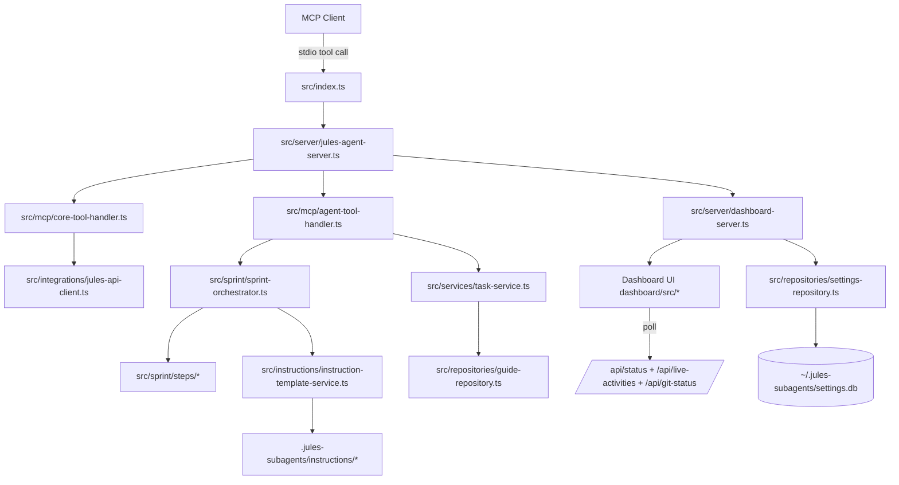

# System Overview

This project is a Model Context Protocol (MCP) server for Jules APIs with an integrated dashboard and an atomic sprint orchestration engine.

## Core Responsibilities

- Expose structured MCP tools for sources, sessions, activities, and orchestration.
- Orchestrate sprint subtasks with dependency-aware scheduling.
- Inject engineering guides into Jules task prompts.
- Provide an operational dashboard for status, activity, git, CI, and settings.
- Emit structured logs with request correlation IDs across dashboard and MCP dispatch paths.
- Support editable markdown instruction templates for sprint loop messaging.

## Runtime Components

### 1. Entrypoint and runtime composition
- Bootstrap file: `src/index.ts`
- Responsibilities:
  - Load `.env` and startup config.
  - Construct and run `JulesAgentServer`.

- Runtime composition file: `src/server/jules-agent-server.ts`
- Responsibilities:
  - Instantiate repositories, services, handlers, orchestrator.
  - Register MCP request handlers via `src/server/mcp-request-router.ts`.
  - Start dashboard HTTP server.
  - Start MCP stdio transport.
  - Serve cached dashboard live activity and git status via `src/server/activity-cache-service.ts`.

### 2. MCP tool handlers
- `src/mcp/core-tool-handler.ts`
  - Handles core Jules API tools and wait logic.
- `src/mcp/agent-tool-handler.ts`
  - Handles `sprint_agent` and `task_agent`.

### 3. Sprint orchestration engine
- `src/sprint/sprint-orchestrator.ts`
- `src/sprint/action-required-automation.ts`
- `src/sprint/ci-status-utils.ts`
- Atomic step modules in `src/sprint/steps/*`

### 4. Instruction template system
- `src/instructions/instruction-template-service.ts`
- `src/instructions/instruction-template-repository.ts`
- `src/instructions/instruction-template-renderer.ts`
- Template catalog defaults in `src/instructions/instruction-template-catalog.ts`

### 5. Dashboard server and frontend
- API host: `src/server/dashboard-server.ts`
- Frontend app: `dashboard/src/*`

### 6. Data and settings repositories
- Guides: `src/repositories/guide-repository.ts`
- Subtasks: `src/repositories/subtask-repository.ts`
- Settings DB: `src/repositories/settings-repository.ts`
- Settings defaults/sanitization/storage: `src/repositories/settings-defaults.ts`, `src/repositories/settings-sanitizer.ts`, `src/repositories/settings-db-storage.ts`

### 7. CLI workflow execution helpers
- `src/services/cli-workflow-service.ts`
- `src/services/cli-process-runner.ts`
- `src/services/cli-docker-utils.ts`
- `src/services/cli-workflow-text-utils.ts`

### 8. Shared logging and correlation
- `src/shared/logging/logger.ts`
- `src/shared/logging/correlation-id.ts`

## Runtime Architecture Diagram

## High-Level Data Flow

1. MCP client sends tool call over stdio.
2. Server dispatches tool to core or agent handler.
3. Handler invokes Jules API client and/or orchestrator.
4. Orchestrator runs atomic steps and updates `lastStatus`.
5. Dashboard polls `/api/status` and `/api/live-activities`.
6. UI renders task pipeline, protocol instructions, and git/CI state.

## Configuration Priority Model

For `.jules-subagents/settings.json` and guides, priority is resolved by search order in repositories and config loader.

Typical priority order (highest first):
1. Repo-scoped path (when `repo_path` provided)
2. Current working directory
3. Project root
4. Home directory (`~/.jules-subagents`)

Instruction templates use the same pattern, with support for both:
- `.jules-subagents/instructions`
- `.jules-subagents/intructions` (compatibility fallback)

## Safety and Guardrails

- Consecutive session creation failures trigger emergency stop (`maxFailures`).
- Branch preflight can block plan/orchestrate until local and remote sprint branch exist.
- Planning preflight can block status/orchestrate until subtask files exist.
- CI Intelligence settings add protocol-level merge guidance for comments/check gates.

## Extensibility Model

The system is designed for independent edits in these layers:
- Tool interface layer (`src/mcp/*`)
- Orchestration control layer (`src/sprint/sprint-orchestrator.ts`)
- Step behavior layer (`src/sprint/steps/*`)
- Human-facing protocol text layer (`.jules-subagents/instructions/*`)
- Dashboard settings/presentation layer (`dashboard/src/*`)
