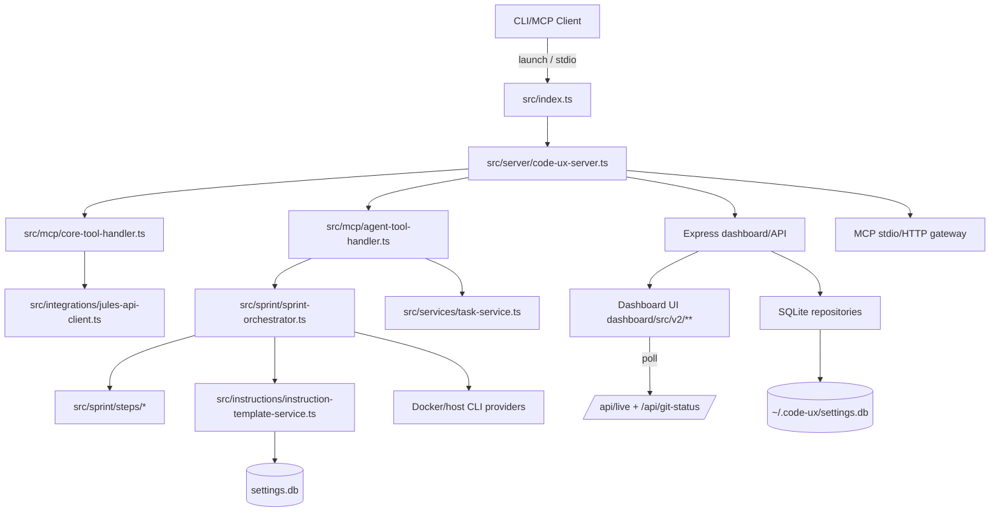

# System Overview

Code UX is a container-first multi-provider runtime with an integrated dashboard and a DB-backed sprint orchestration engine.

## Core Responsibilities

- Expose structured MCP tools for listener, dispatch, and worker control flows.
- Orchestrate sprint subtasks with dependency-aware scheduling.
- Inject editable database-backed agent prompts into planning and worker flows.
- Provide an operational dashboard for status, activity, git, CI, and settings.
- Emit structured logs with request correlation IDs across dashboard and MCP dispatch paths.
- Support editable database-backed instruction templates for sprint loop messaging.

## Runtime Components

### 1. Entrypoint and runtime composition
- CLI/MCP entrypoint: `src/index.ts`
- Responsibilities:
  - Load `.env` and startup config.
  - Bootstrap and run `CodeUxServer`.
- Worker entrypoint: `src/worker/index.ts` (worker-host mode)
- Electron shell: `src/electron/main.ts` (desktop shell)

- Runtime composition file: `src/server/code-ux-server.ts`
- Responsibilities:
  - Composes the runtime by instantiating repositories, services, handlers, and orchestrator.
  - Register MCP request handlers via `src/server/mcp-request-router.ts`.
  - Start dashboard HTTP server (defaults to port 4444).
  - Start MCP stdio transport only for an attached MCP pipe/socket or explicit `CODE_UX_ENABLE_MCP_STDIO=1`; daemon stdin such as `/dev/null` keeps stdio disabled.
  - Serve cached dashboard live activity and git status via `src/server/activity-cache-service.ts`.
- Dependency construction is split through `src/app/dependency-factory/*` (`core-factory.ts`, `dashboard-factory.ts`, `mcp-factory.ts`, `sprint-factory.ts`) and lifecycle services (`src/app/lifecycle/*.ts`).
  - Durable ownership boundaries include MCP lifecycle, dashboard lifecycle, settings lifecycle, snapshot cache, and dependency factories.
  - Dashboard dependency composition uses `LateBoundDependency<T>` from `src/shared/late-bound-dependency.ts` to link circularly-dependent services synchronously.

### 2. MCP tool handlers
- `src/mcp/core-tool-handler.ts`
  - Handles `get_session`, listen-mode, inbox, dispatch, and attention tool calls.
- `src/mcp/agent-tool-handler.ts`
  - Handles worker-local execution and reply helpers.

### 3. Sprint orchestration engine
- `src/sprint/sprint-orchestrator.ts`
- `src/domain/sprint/orchestrator/*`
- `src/domain/sprint/ci/*`
- Atomic step modules in `src/sprint/steps/*`
- Git-mode behavior is split at the final merge gate. REMOTE mode waits for the hosted completion PR to be observed as merged before marking a run complete. LOCAL mode performs the final `feature -> default` merge in the host repository, restores the user's prior checkout afterward, and keeps the run active or paused with merge attention when the local merge fails.

### 4. Instruction template system
- `src/instructions/instruction-template-service.ts`
- `src/instructions/instruction-template-renderer.ts`
- Template catalog defaults in `src/instructions/instruction-template-catalog.ts`
- Templates persisted in scoped settings under `agents.instructionTemplates`

### 5. Dashboard server and frontend
- API host: `src/server/dashboard-server.ts`
- Frontend app: `dashboard/src/v2/**`
  - Active UI source is located under `dashboard/src/v2/**`, consisting of pages, hooks, reusable components, and docs-web helpers.
- Settings view-models: `dashboard/src/v2/lib/settings-view-models.ts` is a compatibility barrel over focused helpers in `dashboard/src/v2/lib/settings/`. Provider instance/auth helpers, model option catalogs, model pricing refs, project override/source helpers, display metadata, and branch naming helpers are kept in separate typed modules so dashboard components can share behavior without changing settings API contracts or saved settings shapes.

### 6. Data and settings repositories
- Persistence uses SQLite via `node:sqlite`.
- Subtasks: `src/repositories/subtask-repository.ts`
- Settings DB: `src/repositories/settings-repository.ts`
- Settings defaults/sanitization/storage: `src/repositories/settings-defaults.ts`, `src/repositories/settings-sanitizer.ts`, `src/repositories/settings-db-storage.ts`

### 7. CLI workflow execution helpers
- Docker and host CLI providers implementations are in `src/infrastructure/providers/cli/`.
- `src/services/cli-workflow-service.ts`
- `src/services/cli-process-runner.ts`
- `src/services/cli-docker-utils.ts`
- `src/services/cli-workflow-text-utils.ts`
- Docker-backed project setup and dashboard chat invocations seed their provider workspace from the effective default branch snapshot. The checkout contract asks `WorkspaceManager` for the configured branch, which prefers `origin/<defaultBranch>` and falls back to the local branch when the remote tracking ref is unavailable; HOST-mode invocations continue to use their existing cwd behavior.

### 8. Shared logging and correlation
- `src/shared/logging/logger.ts`
- `src/shared/logging/correlation-id.ts`

## Runtime Architecture Diagram

```mermaid
flowchart TD
  A[CLI/MCP Client] -->|launch / stdio| B[src/index.ts]
  B --> R[src/server/code-ux-server.ts]
  R --> C[src/mcp/core-tool-handler.ts]
  R --> D[src/mcp/agent-tool-handler.ts]
  C --> E[src/integrations/jules-api-client.ts]
  D --> F[src/sprint/sprint-orchestrator.ts]
  F --> G[src/sprint/steps/*]
  F --> H[src/instructions/instruction-template-service.ts]
  H --> I[(settings.db)]
  D --> J[src/services/task-service.ts]
  R --> L[Express dashboard/API]
  L --> M[Dashboard UI dashboard/src/v2/**]
  M -->|poll| N[/api/live + /api/git-status/]
  L --> O[SQLite repositories]
  O --> P[(~/.code-ux/settings.db)]
  R --> Q[MCP stdio/HTTP gateway]
  F --> S[Docker/host CLI providers]
```

## High-Level Data Flow

1. MCP client sends tool call (e.g., grouped tools like `manage_sprints:start`, rather than the deprecated `manage_code_ux`) over stdio.
2. Server dispatches tool to core or agent handler.
3. Handler invokes the DB-backed dispatch engine, inbox system, and provider execution layer.
4. Orchestrator runs atomic steps and updates `lastStatus`.
5. Dashboard polls `/api/live` for one combined runtime snapshot, while websocket updates and the execution event log keep task feeds fresh between polls.
6. UI renders task pipeline, protocol instructions, and git/CI state.

## Configuration Priority Model

Settings live in sqlite and are resolved by scope rather than file search.

Priority order:
1. sprint override
2. project override
3. system defaults
4. built-in code defaults

## Safety and Guardrails

- Consecutive session creation failures trigger emergency stop (`maxFailures`).
- Branch preflight can block plan/orchestrate until local and remote sprint branch exist.
- Planning preflight can block status/orchestrate until subtask files exist.
- CI Intelligence settings add protocol-level merge guidance for comments/check gates.
- `pnpm run ci` starts with the local quality guardrail script, which blocks stale artifacts, unsafe dependency placeholders, realtime snapshot persistence regressions, duplicate optimistic task insertion, and substantial duplicate implementation blocks before broader validation runs.
- Hot realtime, execution projection, provider telemetry, session sync, and dashboard rendering paths must follow the [Code Quality And Performance Contracts](./code-quality-performance-contracts.md), including bounded snapshot slices and owner-specific verification commands.

## Extensibility Model

The system is designed for independent edits in these layers:
- Tool interface layer (`src/mcp/*`)
- Orchestration control layer (`src/sprint/sprint-orchestrator.ts`)
- Step behavior layer (`src/sprint/steps/*`)
- Human-facing protocol text layer (`agents.instructionTemplates` in settings)
- Dashboard settings/presentation layer (`dashboard/src/v2/**`)
