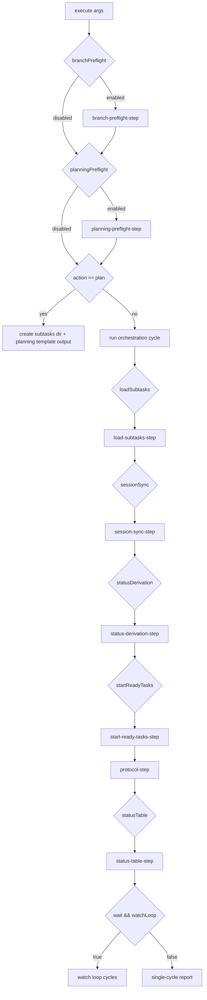

# Atomic Sprint Loop

This document explains the sprint orchestrator control flow and each atomic step.

## Entry Point

- File: `src/sprint/sprint-orchestrator.ts`
- Public method: `execute(args: SprintAgentArgs)`
- Shared args type: `src/sprint/sprint-types.ts`
- Supporting modules:
  - `src/domain/sprint/orchestrator/*`
  - `src/domain/sprint/ci/*`

## Actions

- `plan`
- `status`
- `orchestrate`

## Step Toggle Settings

Controlled by `dashboardSettings.sprintLoopSteps`:

- `branchPreflight`
- `planningPreflight`
- `loadSubtasks`
- `sessionSync`
- `statusDerivation`
- `startReadyTasks`
- `mergeProtocol`
- `actionRequiredProtocol`
- `statusTable`
- `watchLoop`

## Loop Flow Diagram

## Pull Request Content Rules

Automatically created PRs must provide sufficient human context:
- **Worker Feature PRs** (`worker-branch -> sprint-feature-branch`): Must include both the current task description (from the prompt) and the sprint goal/description in the PR body.
- **Main Merge PRs** (`sprint-feature-branch -> default-branch`): Must include the sprint description alongside branch and sprint numbering metadata.
- If task or sprint descriptions are missing/empty, PR bodies will use a compact fallback text instead of omitting sections.

## Execution Phases

### 1. Branch preflight (optional)
- Step module: `branch-preflight-step.ts`
- Applies to: `plan` and `orchestrate`
- Validates sprint feature branch exists:
  - locally
  - on remote origin
- On failure: returns templated blocker instructions.

### 2. Planning preflight (optional)
- Step module: `planning-preflight-step.ts`
- Applies to: `status` and `orchestrate`
- Ensures subtask markdown files exist in sprint subtask directory.
- On failure: returns templated planning blocker.

### 3. Plan action
If `action=plan`:
- Creates subtask directory if missing.
- Optionally injects `sprint_agent_guide.md`.
- Returns templated planning instructions.

### 4. Orchestration cycle
For `status` and `orchestrate`, each cycle can run:

1. Load subtasks
- `load-subtasks-step.ts`

2. Sync sessions and activities
- `session-sync-step.ts`
- Sync source is provider-agnostic:
  - Jules API sessions (when available)
  - locally tracked CLI sessions (`gemini`/`codex`)

3. Derive effective task status
- `status-derivation-step.ts`

4. Start ready tasks (orchestrate only)
- `start-ready-tasks-step.ts`
- Provider is selected per task using `aiProvider` strategy.
- For CLI providers the workflow is:
  - create child task branch from sprint feature branch
  - run CLI in background
  - commit/push branch
  - open PR back to sprint feature branch
  - track state and activity in sqlite

5. Build protocol instructions
- `protocol-step.ts`
 - Action-required tasks are separated into:
   - `AGENT INTERVENTION NEEDED`
   - `HUMAN INTERVENTION NEEDED`

6. Build status table
- `status-table-step.ts`

### Automation intervention routing

Action-required Jules sessions (`AWAITING_PLAN_APPROVAL`, `AWAITING_USER_FEEDBACK`, `PAUSED`) are routed by automation policy:
- `FULL`: auto-intervene for all supported action-required states.
- `SEMI_AUTO`: obey `automationInterventions` toggles.
- `ALWAYS_ASK`: no auto-intervention.
- Worker-generated clarification replies are tracked against the persisted task record id (`record_id`) when available, not the display task key (`T01`, `T02`, ...), so auto-intervention does not fail during execution-invocation logging.
- Worker-generated clarification replies now use the editable `Project manager` agent preset instead of worker instructions, and the prompt includes a dedicated Jules clarification-request section so the latest explicit message is preserved when available.
- Worker-generated clarification replies unwrap CLI provider response envelopes before they are sent back to Jules, even when bootstrap or package-manager output surrounds the JSON envelope.
- Clarification dedupe ignores Code UX's own user reply activity and keys silent Jules prompts by the latest non-user activity id/time, so repeated polling of the same activity is idempotent while a later unanswered Jules activity is treated as a new request.

When auto-intervention fails, tasks are routed to `AGENT INTERVENTION NEEDED` with context.

## Watch Mode

When `action=orchestrate`, `wait` is true, and `watchLoop` is enabled:
- Orchestrator enters continuous loop.
- Wait interval is 10 seconds between cycles.
- Output interval defaults to 300 seconds and is now used only as an internal checkpoint boundary for heartbeat/lease renewal inside the same sprint run.
- Code UX does not stop at that boundary anymore. It keeps the same sprint run alive, renews its lease/heartbeat, resets the checkpoint window, and continues watching until a real terminal condition is reached.
- Loop exits when:
  - all tasks terminal (`COMPLETED+merged` or `FAILED`), or
  - no runnable tasks remain, or
  - merge-required tasks are detected.

On completion it may:
- clean up subtask directory,
- append completion steps,
- preserve files when failures remain.

## Single-Cycle Fallback

If caller requests wait mode but `watchLoop` toggle is disabled:
- orchestrator runs one cycle,
- returns normal report with a note that watch mode is disabled.

For `action=status`:
- orchestration always runs as a single cycle for immediate output,
- `wait: true` is ignored and reported as informational text.

## CI Intelligence Integration

`ciIntelligence` settings affect generated protocol text:
- CI status classification is centralized in `src/sprint/ci-status-utils.ts` via `isCiFailure(status, conclusion)` and `isCiPending(status, conclusion)` so feature and main merge gates evaluate checks with the same rules.
- Feature-branch merge instructions can require CI wait and comment resolution.
- Final merge-to-main instructions can require CI wait and comment resolution.
- When a task finishes provider work but its feature PR is still missing, pending, failing, or review-blocked, the CI gate now persists that task back to in-progress state in project task records so dashboard task lists do not incorrectly show it as finished.
- When QA requests fixes and Code UX applies them through a same-session CLI follow-up, the next sprint cycle treats the completed `cli_task_followup` invocation as fresh task work and reruns QA verification instead of waiting for a separate task-run completion timestamp.
- Before task QA gates are evaluated, the sprint cycle reconciles running task QA invocations with provider runtime state. Missing provider linkage or a missing Docker session container makes the stale QA row retryable instead of blocking the task indefinitely at `QA_PENDING`.
- In local-git mode, when a task completed without a PR and then receives QA fixes, the QA follow-up process continues by attempting to recover the worker branch from task/task run metadata, open/merged PR metadata, or git branch name matching. If the preserved resume workspace is missing, Code UX prepares/recreates the expected worktree on the recovered branch and continues the QA follow-up run without failing. If no branch can be recovered and no safe workspace can be prepared, the orchestrator fails fast.
- Feature-PR auto-merge mode `WHEN_GREEN` waits for a green gate before attempting the merge.
- Main-branch auto-merge mode `ALWAYS` intentionally bypasses the main CI wait gate and attempts the final `feature -> default` merge as soon as the PR is not conflicted or review-blocked.
- If `waitForJulesCiAutofix` is enabled and feature PR checks fail, the sprint loop notifies the Jules session with failed-check context, matched failed run ids/URLs, failed job names, and failed-job log excerpts (when available), then keeps the task in work state.
- CI autofix retries are capped by `julesCiAutofixMaxRetries`; once exhausted, the task is escalated as intervention-needed with exact task id, PR URL, failed check names, failed run summary, and failed job names (focus: fix CI before merge).
- Worker-owned CI autofix attempts are de-duplicated across watch-loop cycles. While a matching `ci_fix_required` attention item is still open or claimed, Code UX treats that attempt as in-flight, keeps the task in `RUNNING`, and does not consume another retry until the worker attempt resolves.

## Files and Data Used

- Subtasks directory:
  - `.jules-subagents/sprints/sprint<N>-subtasks/`
- Guide files:
  - `.jules-subagents/agents/*.md`
- Instruction templates:
  - `.jules-subagents/instructions/sprint-main-loop/**/*`
- CLI session tracking DB:
  - `~/.jules-subagents/session-tracking.db`

## Operational Advice

- Keep branch and planning preflight enabled in production.
- Disable individual steps only for diagnostics or controlled experiments.
- Treat instruction templates as runtime policy text, not source logic.
