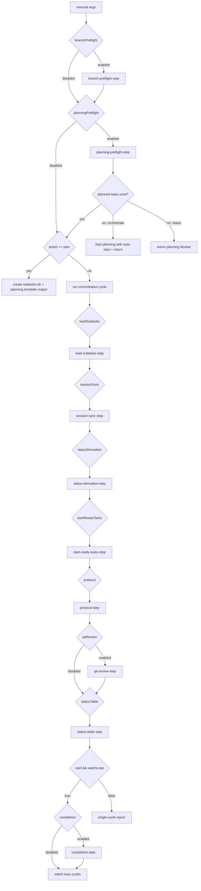

# Atomic Sprint Loop

This document explains the sprint orchestrator control flow and each atomic step.

## Entry Point

- File: `src/sprint/sprint-orchestrator.ts`
- Public method: `execute(args: SprintAgentArgs)`
- Shared args type: `src/sprint/sprint-types.ts`
- Current orchestration split modules:
  - `src/domain/sprint/orchestrator/sprint-orchestrator.ts`
  - `src/domain/sprint/orchestrator/sprint-action-runner.ts`
  - `src/domain/sprint/orchestrator/cycle-runner.ts`
  - `src/domain/sprint/orchestrator/watch-loop-runner.ts`
  - `src/domain/sprint/orchestrator/watch-loop-state-machine.ts`
  - `src/domain/sprint/orchestrator/cycle-state-coordinator.ts`
  - `src/domain/sprint/ci/feature-pr-gate.ts`
  - `src/sprint/steps/*`

## Actions

- `plan`
- `status`
- `orchestrate`

## Step Toggle Settings

Controlled by `dashboardSettings.sprintLoopSteps`:

- `branchPreflight`
- `planningPreflight`
- `loadSubtasks`
- `sessionSync`
- `statusDerivation`
- `startReadyTasks`
- `protocol`
- `qaReview`
- `statusTable`
- `watchLoop`
- `completion`

## Loop Flow Diagram


```mermaid
flowchart TD
  A[execute args] --> B{branchPreflight}
  B -->|enabled| C[branch-preflight-step]
  B -->|disabled| D
  C --> D{planningPreflight}
  D -->|enabled| E[planning-preflight-step]
  D -->|disabled| F
  E --> X{planned tasks exist?}
  X -->|no, orchestrate| Y[start planning with auto-start + return]
  X -->|no, status| Z[return planning blocker]
  X -->|yes| F{action == plan}
  F -->|yes| G[create subtasks dir + planning template output]
  F -->|no| H[run orchestration cycle]
  H --> I{loadSubtasks}
  I --> J[load-subtasks-step]
  J --> K{sessionSync}
  K --> L[session-sync-step]
  L --> M{statusDerivation}
  M --> N[status-derivation-step]
  N --> O{startReadyTasks}
  O --> P[start-ready-tasks-step]
  P --> Q{protocol}
  Q --> R[protocol-step]
  R --> R1{qaReview}
  R1 -->|enabled| R2[qa-review-step]
  R1 -->|disabled| S{statusTable}
  R2 --> S{statusTable}
  S --> T[status-table-step]
  T --> U{wait && watchLoop}
  U -->|true| U1{completion}
  U1 -->|enabled| U2[completion-step]
  U1 -->|disabled| V[watch loop cycles]
  U2 --> V[watch loop cycles]
  U -->|false| W[single-cycle report]
```

## Pull Request Content Rules

Automatically created PRs must provide sufficient human context:
- **Worker Feature PRs** (`worker-branch -> sprint-feature-branch`): Must include both the current task description (from the prompt) and the sprint goal/description in the PR body.
- Worker feature PR timing is rendered with the same completion timestamp later persisted to the task run, so PR bodies show `Finished` and `Duration` even though the PR is opened just before task-run finalization.
- **Main Merge PRs** (`sprint-feature-branch -> default-branch`): Must include the sprint description alongside branch and sprint numbering metadata.
- Main merge PR timing uses the sprint run's persisted `startedAt` plus the finalization timestamp captured at PR creation time until the sprint run completion row is persisted. Once `finishedAt` exists on the sprint run, that stored value remains authoritative for historical PR rendering.
- If task or sprint descriptions are missing/empty, PR bodies will use a compact fallback text instead of omitting sections.
- The `default-branch` target is the resolved scoped `git.defaultBranch` value (`system -> project -> sprint` settings). Legacy project metadata cannot override it during sprint completion, so inherited system defaults such as `dev` remain the final merge target.

## Execution Phases

### 1. Branch preflight (optional)
- Step module: `branch-preflight-step.ts`
- Applies to: `plan` and `orchestrate`
- Validates that the sprint feature branch exists locally and on the remote origin (`LOCAL` vs `REMOTE` git behavior applies). During orchestration, it creates a missing feature branch from the default branch and publishes it when a remote is required.
- Immediately before the first task dispatch, an unstarted sprint refreshes its feature branch to the latest scoped default-branch commit when Git can perform a true fast-forward. Any feature-only commit preserves the existing branch instead; no merge, rebase, reset, or history rewrite is attempted. Once any sprint task has execution history, automatic default-branch refresh is permanently skipped for that sprint.
- Records the default-aligned base commit SHA when a branch is freshly created or safely refreshed.
- Idle sprints expose **Update Branch** in the Sprints action menu. This performs the same safe fast-forward on demand and refuses the update after task work has started or when the feature branch has diverged.
- On failure: returns templated blocker instructions.

### 2. Planning preflight (optional)
- Step module: `planning-preflight-step.ts`
- Applies to: `status` and `orchestrate`
- Verifies that the sprint subtask directory exists and contains at least one `.md` file.
- Starting an unplanned sprint launches planning automatically after branch preflight finishes. Planning is de-duplicated per project and sprint, saves the generated tasks, and requests orchestration again through the normal start path.
- A repeated start while that automatic planning request is still running reports the existing request instead of submitting another provider invocation.
- `status` remains read-only: an unplanned status request returns the templated planning blocker and never launches planning.
- Planning self-reflection retains its existing gate. If reflection does not pass, valid tasks remain saved but orchestration does not start automatically.

### 3. Plan action
If `action=plan`:
- Creates subtask directory if missing under `.code-ux/sprints/**`.
- Uses DB-backed planning to generate or regenerate subtasks, writing the resulting sprint subtask markdown artifacts to `.code-ux/sprints/**`.
- Optionally injects `sprint_agent_guide.md`.
- Returns templated planning instructions.
- Planning may apply a provider-suggested sprint title only when the sprint was explicitly stored as generated/auto-named at creation time. Placeholder-looking custom titles such as `Untitled sprint 1` are treated as user titles and are not writable by planning.
- Planning self-reflection is available under `agents.selfReflection.planning` and defaults to `enabled: false`. When enabled, the planning provider rates its parsed JSON output against configured `{ id, label, prompt, threshold }` criteria using JSON-only 1-10 scores. Below-threshold ratings can trigger same-session improvement prompts up to `maxImprovementAttempts`, but every improved plan is parsed through the existing planning JSON extractor and `PlanningPayloadValidator`, so DAG order, task keys, dependency references, and required prompt sections remain mandatory.
- Planning reflection is optional and fail-open. Malformed reflection JSON, provider failures, or invalid improved planning JSON are logged and leave the last valid parsed plan in place rather than bypassing validation or corrupting the accepted output.
- Planning reflection gates planning autostart when it is enabled. A request with `autoStart: true` starts orchestration only after the final planning reflection decision passes; if reflection fails, reaches the improvement-attempt limit without passing, or cannot parse an improvement, Code UX persists the valid planned tasks and leaves the sprint planned but not running.
- Operators can manually start a planned sprint after reviewing or editing the tasks when planning reflection does not pass. When planning reflection is disabled, `autoStart: true` keeps the existing behavior and starts immediately after valid tasks are persisted.
- Reflection audit records are appended to the planning execution invocation as message metadata. The metadata stores criteria, thresholds, scores, pass/fail state, attempt count, and final decision; it does not duplicate provider credentials.

### 4. Orchestration cycle
For `status` and `orchestrate`, each cycle follows the strict execution order defined in `CycleRunner.run`:

1. **Load subtasks**: Reads subtask markdown files via `SprintExecutionStateService` and reconciles them with the current DB task and task_run execution state.
2. **Snapshot entry states**: Captures task statuses at the start of the cycle.
3. **Sync sessions**: Synchronizes hosted provider sessions and local/CLI/worker dispatch state through execution records and provider invocations. Sync source is provider-agnostic.
4. **Derive effective task status**: Applies pre-CI status normalization rules. For example, a `COMPLETED` task with unmerged PR evidence is moved back to `CODING_COMPLETED`, and settled merge evidence officially marks a task as `COMPLETED`. Intervention and merge indicators are also refreshed.
5. **Start ready tasks** (`orchestrate` only):
   - Filters `PENDING` tasks, skips quota cooldowns, applies coding guardrails, and respects provider concurrency deferrals.
   - Evaluates the readiness gate: a task must be `PENDING`, dependencies completed and merged, provider concurrency available, and emergency stop inactive.
   - Provider concurrency admission uses global provider load from both running provider invocations and running task runs. This matters for CLI/Docker providers because a task run can reserve orchestration capacity before its provider invocation row starts.
   - Task dispatch creates DB task dispatch and task-run records, selects the provider based on settings (uses hosted provider for `jules` and CLI/Docker or host workflows for local providers).
   - Capacity deferral is never a task failure. If a lower provider stage reports the cap after dispatch rows were created, the dispatch returns to `queued`, the task run returns to `PENDING`, and the project task returns to `pending` for a later cycle.
   - Marks tasks `RUNNING`, records session id/name/provider, and resets consecutive failure count on success. Triggers emergency stop after repeated real dispatch failures.
6. **Apply protocol step**:
   - Provider-agnostic handling of plan approval, clarification replies (via Project manager preset), and paused sessions, utilizing cooldown/dedupe rules and escalating attention items when necessary.
   - Gathers CI data for feature branches.
   - Ensures PRs are tracked accurately.
   - Evaluates completed coding work (`CODING_COMPLETED`). QA is a formal part of the merge gate, evaluating the work rather than acting as a vague final-only review. This handles retry/review behavior, stale QA invocation reconciliation, QA follow-up reruns, and transitions tasks back to in-progress when PR/CI/QA is not merge-ready.
   - Evaluates completed coding work for PR/CI/merge readiness, review blockers, merge conflicts, missing PRs, and attention items. CLI-backed branch-only tasks wait for git finalization evidence (`cli_git_pushed` or `cli_git_no_changes`) before protocol can surface merge-required attention, so provider completion cannot race ahead of branch materialization. Does not automatically merge or apply fixes unless tied to configured auto-merge modes and intelligence settings.
   - Saves the result of the CI merge gates.
   - Re-evaluates state and starts ready tasks if merges unblocked dependencies.

7. **Build status table output**:
   - Compiles the final cycle report and separates action-required tasks into agent and human intervention categories.

## Watch Mode

When `action=orchestrate`, `wait` is true, and `watchLoop` is enabled:
- Orchestrator executes continuous cycles.
- The default wait interval is 1 second between cycles and remains configurable per scope. Explicit existing project or sprint overrides are preserved.
- Checkpoint reports (based on `watchLoopOutputIntervalSeconds`) are emitted without ending the run. The checkpoint boundary is used to renew heartbeats and leases inside the same sprint run, keeping it alive while resetting the checkpoint window.
- The loop continuously observes pause and cancel interventions at the top of each cycle.
- Finalisation only runs on terminal conditions.
- Startup recovery and dashboard **Resume** restart monitoring through the existing-run recovery path. A resumed paused run keeps its original sprint-run id, is moved back to `running`, and then starts the watch loop without creating a duplicate run. Resume is refused while another queued/running/cancel-pending run for the same sprint is active.
- If shutdown lands after a coding provider has completed but before Git finalization records the task as code-complete, recovery preserves the workspace and marks that exact crash window. The replacement task run resumes at Git finalization and reuses the completed provider result instead of invoking the coding agent a second time. A missing preserved workspace falls back to a normal fresh invocation rather than trusting unavailable changes.
- Under the restart invocation `continue` policy, startup treats QA review, CI fix, and merge-conflict repair as durable work streams just like task coding. It closes each interrupted audit invocation, preserves its logical/native session and workspace binding, and requeues only the work needed to create the correlated continuation. Claimed repair attention is released from the stopped virtual-worker endpoint before the next worker poll.
- Existing-run recovery first checks the in-memory active-orchestrator registry and returns without starting another watch loop when the same project/sprint is already being monitored by the current process.
- Sprint-run lifecycle updates are mirrored to the parent sprint row for dashboard/operator consistency. Active run states (`queued`, `running`, `cancel_requested`) keep the sprint `running`; pause, completion, failure, and cancellation transitions update the sprint row to the matching summary state. Heartbeats also repair drift after restarts, so a live run cannot remain hidden behind an `idle` sprint summary.
- Human-escalated merge conflicts stop counting as worker activity. If a task conflict has already been handed to a human and no runnable work remains, the watch loop pauses the sprint instead of keeping the run alive with only heartbeat traffic.
- When a sprint completes or is cancelled, Code UX resolves transient merge attention and merge-derived human handoff items for that run so completed local-git sprints do not remain pinned to intervention by stale conflict rows.
- During each cycle, task-level human merge-conflict handoffs are dismissed by exact attention-item id once the task no longer carries a `MERGE_CONFLICT` marker. Main-merge handoffs and unrelated manual attention remain open. If Git still reports a real conflict later, the normal merge gate opens a fresh worker-owned conflict item.
- Sprint cancellation also marks running provider invocations and QA review rows for the sprint run as cancelled, including sprint-level QA invocations that are not attached to an active task dispatch, and stops their Docker sessions when containers are still present.
- Merge attention is not cleared while a task is still in the `CI` stage. This keeps dirty PRs and unresolved CI/merge blockers visible instead of silently heartbeating a sprint with no active dispatches.
- Live CLI telemetry stays enabled during watch mode, including transcript parsing and token accounting. To keep high-concurrency sprints responsive, each provider watcher fingerprints its current stdout/stderr and provider log sources, uses cheap file/source metadata before reading full provider transcripts when available, skips provider-specific read and parse/token work when the sources are unchanged, reuses Codex tokenizer encodings and recent token counts, and only persists provider usage rows when token/transcript state changes.
- Provider telemetry watchers are best-effort and never fail the provider run. Repeated watcher read or parse failures are logged as throttled runtime warnings with provider, Code UX session id, native session id when known, and failure count, without including prompts, transcripts, raw streams, or credentials.
- Watch-loop cycles publish dashboard status snapshots only when the semantic sprint status changes. Timestamp-only repeats are suppressed per sprint run, while finalization blockers are still force-published so operators see terminal merge or pause feedback immediately.
- The watch loop reuses active project-attention rows already loaded by the cycle runner when evaluating terminal state. It only falls back to a direct attention read if an older or test cycle result does not provide the cycle-loaded rows.
- LOCAL Git-finalization evidence is collected by the cycle runner after its final merge drain and passed to the watch loop for terminal-state evaluation. The watch loop does not rescan every task-run event history unless it is running with a legacy/test cycle result that lacks that snapshot.
- Session synchronization compares provider state with persisted task-run, dispatch, and planning state before writing. Unchanged active sessions do not rewrite rows; dispatch liveness heartbeats are refreshed at most once per minute, while state, error, branch, PR, start, and finish changes are persisted immediately.
- Feature-PR gate evaluation uses one immutable local-Git event snapshot per task per cycle. Duplicate idempotent task-run events do not invalidate runtime wall-time caches or publish realtime refreshes.
- A task or merge-state change triggers one bounded 250 ms follow-up cycle before the loop resumes its configured polling interval. This removes avoidable dependency-unlock and merge-drain delay without busy-polling unchanged provider work.
- Dashboard live snapshots are optimized for high sprint concurrency: selected-sprint checks use targeted project/sprint lookups instead of hydrating every sprint, recent provider activities are cached until the project's latest provider activity event changes, and provider activity event reads use partial sqlite indexes for the activity-only paths.
- Preview reconciliation also avoids full project execution snapshots in the common running-session path. It queries running sprint runs directly and memoizes that result while reconciling preview sessions and auto-starting previews.
- Docker CLI task workspaces prepare independently. The prepare path locks only the specific workspace being created or resumed, deduplicates in-flight exact remote-branch fetches per repo and branch, and reserves the repo-wide lock for host `git worktree` metadata operations. This keeps wide DAGs from serializing every Docker volume seed behind one project-level lock.
- Docker workspace seed also checks out the worker branch and initializes the paired runtime-volume ownership in the same helper container, so prepare avoids separate checkout and runtime-chown helper startups. Concurrent workspaces that need the same targeted seed refs share a short-lived, ref-tip-keyed bundle; broad `--all` snapshot bundles are only reused while the bundle is actively in flight. The public helper image check is cached per process after a successful inspect/pull so wide DAGs do not re-run `docker image inspect alpine/git` for every helper command.
- Docker workspace patch export runs as one workspace shell command: it builds a temporary index, asks Git to stream untracked paths with `ls-files -z`, stages them with `xargs -0 git add --intent-to-add --`, emits `git diff --binary`, and removes the temporary files with a shell trap. This avoids several helper-container startups per completed task and keeps large untracked file sets out of Docker argv.
- Host-side patch materialization runs as one shell command for the non-network work: apply the binary patch into a temporary index, write the tree, create the commit, update the worker branch, refresh a clean checked-out worker branch when needed, and emit numstat. Remote-git mode still performs fetch/push retry outside this command; local-git mode skips remote probing and push entirely.
- Active attention reads are bounded high enough for 100+ task DAGs, so the cycle reasons over the complete active attention set instead of a partial page.
- CLI task runs release provider capacity as soon as the worker branch has been materialized and `cli_git_pushed` is recorded. PR finalization then updates PR metadata on the completed run instead of keeping the provider slot occupied.
- Provider-cap deferrals are logged once per provider per cycle instead of once per blocked task. The aggregate includes the provider id, cap, current count, blocked-task count, representative task ids, and whether the cap was observed before dispatch or inside dispatch.
- Provider load for start-ready admission combines running provider invocations with active task runs that have not yet produced terminal provider evidence. This prevents wide DAG cycles from creating a large queue of running Docker dispatches that all wait inside the provider-slot gate before their provider invocation rows exist. Provider-slot wait logs are also throttled per provider across concurrent waiters.
- Loop exits when:
  - all tasks reach their terminal state (e.g., `COMPLETED` + merged, or `FAILED`) and the final merge is settled: remote-git mode requires GitHub to report the completion PR as merged, while local-git mode requires the sprint feature branch to merge into the configured local default branch, or
  - no runnable tasks remain and no sprint-scoped worker or human handoff is still active, or
  - merge-required tasks are detected that need manual intervention.
- The checkpoint window triggers internal reports and lease renewals without stopping the run. Task/QA guardrail handoffs keep the run alive so it can observe their resolution; explicit dashboard control and final main-merge policies such as `CREATE_PR` may still pause the run. Cancellation remains terminal.
- In local-git mode, the final sprint feature-branch merge runs in a temporary Git worktree and force-updates the configured default branch after the merge succeeds. The visible project checkout is not switched between branches, so user-facing local workspaces stay on the branch the operator had checked out.
- If that visible checkout has user-created dirty work at finalization time, Code UX first preserves that work on a `dirty-ref-<uuid>` branch, completes the clean sprint merge, and then copies the preserved dirty commit back into the visible checkout with `cherry-pick --no-commit` followed by an unstage step. Non-conflicting dirty files therefore return as ordinary uncommitted working-tree changes, not as a merge commit. If the restore conflicts or cannot be applied cleanly, Code UX aborts the restore, leaves the dirty branch intact, and opens a dashboard attention item naming the branch and affected paths. Dirty files under the repo-local `.code-ux/` directory are ignored by this preservation check so Code UX runtime artifacts do not block or alter local merges. When the checked-out target branch is the one being updated, the working tree is refreshed to match the merged commit before dirty work is restored.
- The watch loop uses the same `task-transition-state.ts` helper as the cycle
  runner to classify settled tasks, failed terminal tasks, PR-backed merge waits,
  QA-pending tasks, quota waits, dependency blockers, and worker attention waits.
  Protocol text and status table rendering remain separate presentation steps.

On completion or pause, Code UX performs finalization cleanup where the source supports it. It triggers memory auto-promotion, removes orphaned Docker worktrees from terminal CLI dispatches, and clears temporary workspaces, but it never blindly deletes execution artifacts if failures or active blocks remain.

## Single-Cycle Fallback

If caller requests wait mode but `watchLoop` toggle is disabled:
- orchestrator runs one cycle,
- returns normal report with a note that watch mode is disabled.

For `action=status`:
- orchestration always runs as a single cycle for immediate output,
- `wait: true` is ignored and reported as informational text.

## CI Intelligence Integration

`ciIntelligence` settings affect generated protocol text:
- CI status classification is centralized in `src/sprint/ci-status-utils.ts` via `isCiFailure(status, conclusion)` and `isCiPending(status, conclusion)` so feature and main merge gates evaluate checks with the same rules.
- Feature-branch merge instructions can require CI wait and comment resolution.
- Final merge-to-main instructions can require CI wait and comment resolution.
- When a task finishes provider work but its feature PR is still missing, pending, failing, or review-blocked, the CI gate now persists that task back to in-progress state in project task records so dashboard task lists do not incorrectly show it as finished.
- When a completed CLI task has a recorded worker branch but no PR, the feature PR gate verifies that the branch still exists and has commits ahead of the sprint feature branch. If the branch is missing or has no unmerged commits, Code UX clears the stale worker-branch evidence, settles the task as completed with no merge marker, and avoids opening a permanent `merge_required` attention item for no-op work.
- Completed CLI tasks with a worker branch but no PR use the deterministic branch-only merge path in both LOCAL and REMOTE git modes; REMOTE mode then pushes the sprint feature branch. If the markdown/task snapshot lost `worker_branch`, the gate recovers it from the latest completed task run before deciding whether merge work exists. For CLI-backed task runs, the gate waits for a git-finalize event (`cli_git_pushed` or `cli_git_no_changes`) before classifying branch-only work, so provider/session completion cannot race ahead of worker-branch materialization. Task QA always receives an isolated snapshot of its selected worker branch: Docker uses a volume snapshot and HOST uses a detached Git worktree, so the visible default-branch checkout cannot create false missing-file review failures. The task merge runs in a temporary worktree through the containerized Git helper, so the visible checkout, user dirt, and `.code-ux/` runtime files cannot block or be modified by worker-branch settlement. A LOCAL gate reuses one detached temporary worktree for all clean worker branches found in the same cycle, but updates the feature-branch ref after every successful merge; a conflict is aborted and isolated without rolling back earlier published merges. Feature-ref publication uses an atomic expected-old-tip update. When a task merge and CI-fix patch materialization overlap, the losing writer rebuilds on the newly published tip and retries, preserving both histories without serializing independent provider work behind a process-wide lock. Temporary worktree gitdir metadata is normalized to relative paths after creation so every later helper-container Git call resolves the same host repository.
- Once a task is settled as merged, runtime projection suppresses stale `task_runs.worker_branch` evidence so old completed runs do not re-enter branch-only merge scans or keep the dashboard showing dead per-task branches.
- In `WHEN_GREEN` feature PR mode, a clean PR with no check-rollup entries and no tracked CI runs is treated as CI-skipped after a 10 minute grace window. This prevents feature PRs from heartbeating forever when the repository has PR workflows but no run is ever materialized for that branch.
- When QA requests fixes and Code UX applies them through a same-session CLI follow-up, the next sprint cycle treats the completed `cli_task_followup` invocation as fresh task work and reruns QA verification instead of waiting for a separate task-run completion timestamp. The task remains `CODING_COMPLETED`/`QA_PENDING` between handoff settlement and verification dispatch, closing the restart window in which ordinary coding could otherwise be launched. If a restart happens before that invocation marker is persisted, the cycle can also use a later completed task run for the task's current session as recovery evidence, preventing a completed fix attempt from staying parked forever.
- QA reviewer execution is correlated by exact invocation id and reviewer preset, with a distinct logical session and isolated workspace for each reviewer row. Restart continuation reuses that workspace and resumes the provider-native conversation only while completing the same interrupted reviewer cycle. Once a decisive verdict is saved and follow-up work can change the branch, the next verification cycle creates a fresh snapshot instead of inheriting the pre-fix review workspace. A `changes_requested` row records `pending` before its coding continuation begins, so the next cycle can resume an interrupted handoff or settle an already-completed follow-up instead of heartbeating forever behind the saved verdict.
- Task-completion and completed-without-PR QA use the trigger's ordered `agentPresetIds` list. `[]` means zero custom reviewer IDs plus one built-in/default QA fallback; one ID runs one reviewer; multiple IDs run multiple reviewers in order. Each resolved reviewer creates its own `qa_review_runs` row in the same review cycle with the same `run_index`, for example `agent-qa-security` and `agent-qa-regression` can both review `project-123` task `T02` in run `2`. The cycle passes only when every reviewer passes. Any reviewer that requests changes, fails, or is still running keeps the task blocked under the existing QA gate rules, and reviewer rows remain visible per agent.
- QA self-reflection is available under `agents.selfReflection.qualityAssurance` and also defaults to disabled. When enabled, QA results follow the same rate-and-improve loop as planning, and any improved QA output must pass the normal normalized QA schema before it can replace the previous valid result.
- When CLI QA follow-up work creates or reuses a task PR after an earlier PR for the same task was already merged, Code UX clears stale merged state and persists the task as code-complete again so the feature PR gate can evaluate and auto-merge the follow-up PR.
- When a task is parked in `QA_REVIEW_FAILED` but its feature PR is later merged manually, the feature PR gate treats the merged PR as authoritative, marks the task `COMPLETED`/`MERGED`, and lets dependent tasks proceed.
- Repeated watch-loop cycles must be idempotent. Retryable CI observations such as pending checks, pending PR mergeability, and armed auto-merge keep the task in `RUNNING` with the `CI` merge indicator, emit stable task-run event keys, and must not consume another CI-fix retry or redispatch dependent work.
- Dependency unlocks are gated on the dependency's settled pipeline state, not on provider completion alone. A dependent task remains blocked while its dependency is in CI, QA, merge-required, or merge-conflict state, and becomes dispatchable only after the dependency is merged or is confirmed to have no merge work.
- QA is fail-closed. A task whose QA review budget is exhausted under `ESCALATE_TO_HUMAN` is parked in `QA_REVIEW_FAILED`, receives one human-escalation attention item, and repeated cycles do not reopen duplicate attention or let the task merge until a later authoritative merged PR or human action changes the state. A same-session fix spawned by the cap-reaching verdict receives one final verification review; another no-op continuation cannot renew that exception.
- Recovered stale QA reviews in `failed`, `cancelled`, or `errored` state are retryable infrastructure signals even when the verdict budget is otherwise spent, but only below the hard total-attempt ceiling (`maxTaskReviewRuns + QA_INFRA_FAILURE_GRACE`). Every terminal review attempt counts toward that ceiling, so repeated container disappearance eventually applies the exhaustion policy instead of looping forever.
- A same-session CLI QA fix must produce new mergeable Git progress from that invocation. A successful provider exit with no new patch records `follow_up_no_progress` and applies the exhaustion policy immediately rather than starting another review; existing branch commits cannot renew the cycle. Coding prompts also require a structured `CODE_UX_TASK_OUTCOME` marker. A no-change run reported as `blocked`, or one that omits the required outcome, becomes a blocked task dispatch instead of a completed no-output task.
- QA review budgets count review cycles, not reviewer rows. Multiple reviewer rows with the same `run_index` spend one task or sprint QA attempt while still preserving reviewer-specific `agent_preset_id`, `agent_name`, payload details, and task-run events for dashboard history. Latest-cycle summaries prefer blocking rows (`running`, `changes_requested`, or `failed`) over passing rows, so a single passing reviewer cannot hide another reviewer that still blocks the cycle.
- Starting or resuming orchestration resolves stale sprint-level `manual_attention` escalations from prior runs. The new run recomputes current blockers, while task-specific human attention remains open until explicitly handled.
- Before task QA gates are evaluated, the sprint cycle reconciles running task QA invocations with provider runtime state. Missing provider linkage or a missing Docker session container makes the stale QA row retryable instead of blocking the task indefinitely at `QA_PENDING`.
- Sprint-completion QA also uses the sprint trigger's `agentPresetIds` list, or one default fallback reviewer when the list is empty. Completion is allowed only after the latest sprint QA cycle has all reviewers passed; any running, failed, or changes-requested reviewer blocks completion. Before the final configured cycle, a changes-requested review may route follow-up task/session repair through the existing sprint QA logic. The final cycle is verification-only: a non-passing verdict records its findings and escalates without creating work that has no remaining review budget.
- Sprint-completion QA provider/infrastructure failures retry on the next watch cycle even when the task snapshot is unchanged. Each failed cycle advances the configured `maxSprintReviewRuns` guardrail; a non-passing cycle at that cap opens one sprint-scoped `human_escalation_required` handoff even when completed follow-up work changed the task snapshot. The handoff records the attempt count, cap, reason, and latest review summary or provider error, remains deduplicated across runtime restarts, and keeps the sprint run alive while blocking completion. Explicitly resolving it clears only the sprint-completion QA history so the current sprint can run one fresh review cycle; task QA history and guardrail ledgers remain intact.
- Codex error classification reads structured `error`/`turn.failed` events plus stderr, not ordinary JSON event payloads. Agent prose, repository fixtures, and tool output that mention authentication, quota, or rate limits therefore cannot be mistaken for the provider's failure reason.
- Main-merge CI-fix attention records carry explicit source and target branches. A worker-owned CI repair opened during finalization is recognized in that same cycle, so the watch loop waits and keeps heartbeating until the worker succeeds or exhausts the `ci_fix` guardrail instead of pausing beside an active invocation.
- Sprint orchestration resolves LOCAL vs REMOTE git behavior from the effective project/sprint settings (`settings.git.githubMode`). Local-git projects therefore use the local worker-to-feature merge path consistently during both single-cycle and watch-loop runs.
- Sprint orchestration resolves providers from exact provider-config ids in effective settings. A route value such as `mockup-cli` or `gemini-fast` must correspond to a configured provider instance with that exact id; provider-type aliases no longer select arbitrary same-type instances. Sprint/project overrides that explicitly add a provider instance are preserved before route validation so isolated mockup runs cannot fall back to inherited live providers.
- Invocation-route provider maps are replace-on-write at project and sprint scope. If a scoped setting declares `task_coding.providers`, `merge_conflict.providers`, or `qa_review.providers`, that route uses the declared provider-config ids only instead of deep-merging inherited route providers.
- Project-scoped sprint runs ignore stale container-style `repo_path` overrides such as `/workspace` during host-side orchestration, so LOCAL-mode final merges and branch checks use the registered project checkout path.
- Local-git sprint completion performs the final `feature -> default` merge directly in the host repository with no remote host or PR requirement. Remote-style main auto-merge wait states such as `ready_for_merge` do not hold LOCAL runs open; once tasks are settled, LOCAL runs enter the host-side merge path even when individual tasks completed without PR merge markers. The watch loop uses a detached temporary worktree for the final merge so the user's visible checkout and uncommitted files are not disturbed. If the configured local default branch is missing, Code UX creates it from the matching remote/default fallback when available, otherwise from the sprint feature branch.
- Code UX-created repositories seed `.gitignore` with `.code-ux/`. Existing repositories are not silently modified, but LOCAL final-merge dirty detection, dirty-branch preservation, and dirty restore exclude `.code-ux/` by default.
- Local-git final merge failures are fail-closed. Missing refs or git setup errors surface as actionable merge feedback, real merge conflicts open or preserve main-merge attention items, and the sprint run is not marked `completed` until a later watch-loop cycle observes a successful local merge. Remote PR feedback reconciliation does not open or resolve LOCAL main-merge conflict/CI attention; LOCAL attention follows the actual host-side temporary-worktree merge result so worker-owned conflict repair is not cleared prematurely.
- Successful worker-owned merge-conflict resolution clears a task's stale `MERGE_CONFLICT` marker while keeping `is_merged: false`. That clear history is separate from merge-required suppression: the next protocol pass retries the normal task merge path instead of recreating the same conflict loop.
- Resolved worker merge-conflict history suppresses stale merge-required snapshots only after Git confirms the recorded source branch has no commits ahead of the target feature branch. If the branch still has merge work, Code UX clears the stale conflict marker but does not suppress merge-required handling, so branch-only or manual merge paths can continue.
- Worker-owned merge-conflict repair and LOCAL task-branch merges resolve `.code-ux/**` conflicts to the target branch side before deciding whether a provider is needed. A conflict only in Code UX runtime artifacts does not dispatch a provider, provider finalization ignores new `.code-ux/` workspace dirt, and real conflicts outside `.code-ux/` still fail closed. Docker repair workspaces are verified for a valid Git `HEAD` immediately after preparation and are reseeded before provider execution if the volume is invalid.
- In local-git mode, when a task completed without a PR and then receives QA fixes, the QA follow-up process continues by attempting to recover the worker branch from task/task run metadata, open/merged PR metadata, or git branch name matching. If the preserved resume workspace is missing, Code UX prepares/recreates the expected worktree on the recovered branch and continues the QA follow-up run without failing. If no branch can be recovered and no safe workspace can be prepared, the orchestrator fails fast.
- Feature-PR auto-merge mode `WHEN_GREEN` waits for a green gate before attempting the merge.
- Main-branch auto-merge mode `ALWAYS` intentionally bypasses the main CI wait gate and attempts the final `feature -> default` merge as soon as the PR is not conflicted or review-blocked.
- Remote-git sprint completion is fail-closed on the final main merge: Code UX does not mark the sprint run `completed` until GitHub polling reports the completion PR as merged. A successful auto-merge command only keeps the sprint active for another poll; it is not enough to finish the sprint by itself.
- Main-branch auto-merge mode `CREATE_PR` opens or reuses the final completion PR, then pauses for a human handoff until that PR is merged and the sprint is resumed.
- Before creating the final `feature -> default` merge PR, Code UX now verifies that the configured default branch exists on `origin`. If it is missing, Code UX creates it from the repository's actual `origin/HEAD` branch, pushes it, and then creates the final PR against the configured target.
- In LOCAL mode, before the final `feature -> default` merge, Code UX verifies that the configured target branch exists locally. If it is missing, Code UX creates it from the project's stored default branch, then from `main`/`master` as fallback start points, before attempting the local merge or virtual conflict repair.
- Main-branch PR creation failures are logged and surfaced in the final merge gate feedback instead of being reduced to an unexplained missing-PR wait state.
- When the watch loop waits or exits at the final main-merge gate, the dashboard status snapshot is republished with the finalization report so operators can see the current blocker without waiting for a later cycle.
- If feature PR checks fail, the sprint loop keeps the task in work state and enters the CI-fix guardrail path. When `waitForProviderCiAutofix` (the legacy-named configuration for CI autofix) is enabled for a hosted-provider-managed task, Code UX first notifies the hosted provider session with failed-check context from only the newest branch-matched failed CI run: its id/URL and every failed job, step, and actionable error/assertion excerpt. Older matching failures are excluded. When that toggle is disabled, or the task is not hosted-provider-managed, Code UX skips the hosted provider notification and dispatches a worker-owned `ci_fix_required` item.
- CI autofix retries are capped by `ciAutofixMaxRetries` (the legacy-named setting); once exhausted, the task is escalated as intervention-needed with exact task id, PR URL, failed check names, the newest failed-run summary, and every failed job name (focus: fix CI before merge). The cap applies to the generic CI-fix loop, including worker repairs.
- Worker-owned CI autofix attempts are de-duplicated across watch-loop cycles. While a matching `ci_fix_required` attention item is still open or claimed, Code UX treats that attempt as in-flight, keeps the task in `RUNNING`, and does not consume another retry until the worker attempt resolves. This includes the final main-merge gate: after a worker pushes a CI fix and GitHub reports replacement checks as pending, the main-merge `ci_fix_required` item stays active until checks pass, the merge completes, or another blocker replaces it.
- If restart interrupts a claimed worker-owned CI-fix or merge-conflict attempt, startup clears the stale endpoint claim and requeues the same attention item with its repair-session continuation metadata. The next virtual worker reuses the preserved worktree and logical provider session, passes the previous native session id when supported, and does not count the process interruption as a new guardrail attempt. Successful settlement clears the continuation marker before normal CI/merge gating resumes.
- Repair attention takes precedence over queued coding dispatches, and virtual-worker admission checks the provider/limit selected by the actual `ci_fix` route. The final provider-slot claim has a 30-second wait bound, so finalization retries or escalates instead of hanging forever behind a saturated or stale provider slot.
- Failed-job log collection searches the complete log of every failed job in the newest branch-matched failed run for failed-step names, error markers, assertion failures, stack traces, and expected/received output. The prompt receives bounded evidence windows around those signals instead of generic runner bootstrap and cleanup output, plus the exact `gh run view <run-id> --job <job-id> --log-failed` fallback command for each failed job. Older matching runs are not included. Task and final-merge CI repairs use the same evidence payload.
- A task blocked after exhausting CI-fix retries is persisted as `coding_completed` in the planning layer while retaining its runtime CI block and intervention state. Reloading the sprint therefore cannot reinterpret the completed implementation as a pending task and relaunch ordinary `task_coding` work.
- Exhausting the ordinary task-coding guardrail opens a deduplicated human handoff with the attempt count and task/session context instead of only blocking the task in a transient cycle snapshot. Resolving that handoff clears the `task_coding` ledger and permits one fresh dispatch cycle.
- While a task is owned by the CI-repair path, stale `merge_required` or `merge_conflict` attention is resolved so the dashboard exposes the CI repair or human handoff as the single authoritative blocker.
- A CI-fix guardrail exhaustion always opens or refreshes a human-owned handoff, including when startup recovery first observes a legacy ledger already at its cap. The handoff carries only the newest branch-matched failed run, but includes every failed job and step, exact actionable assertion/error excerpt, and fallback log command from that run. Code UX durably parks the task as code-complete with its CI marker, resolves stale worker CI/merge attention, and suppresses generic merge/action attention so recovery cannot relaunch coding or leave the sprint heartbeating behind an unclaimable merge item. Disabling the hosted-provider notification toggle must not disable worker CI repair before the cap.

Focused regression commands for these guarantees:

```bash
pnpm run test:backend -- tests/backend/domain/sprint/orchestrator/cycle-state-coordinator.test.ts tests/backend/domain/sprint/orchestrator/cycle-runner.test.ts tests/backend/domain/sprint/ci/feature-pr-gate.test.ts tests/backend/sprint/watch-loop-core.test.ts
pnpm run test:backend
pnpm run lint
```

## Rollback finalization

Rollback sprints use the same dependency, Git, conflict-repair, and final merge gates as standard sprints. An automatic rollback enters the loop with a settled audit task and skips completion QA and memory-remediation provider work. Agent-assisted rollbacks run their generated rollback task normally. In remote mode, rollback finalization always enables PR tracking and an otherwise disabled main-PR mode becomes `CREATE_PR` for that rollback only. In local mode, finalization leaves PR monitoring disabled and merges the local rollback branch into the configured default branch through the standard temporary-worktree path.

See [Sprint Rollbacks](../architecture/sprint-rollbacks.md) for safety classification and persistence details.


## State Transitions & Recovery

- **Pause**: Transitions `sprint_run` status to `paused` and writes a `sprint_pause_requested` event. For active dispatches, `docker_cli` is aborted, `hosted_provider` receives a halt session message, leases are released, dispatch status becomes `paused`, and `task_run` state becomes `PAUSED` (appending a `dispatch_paused` event). Tasks are reset to `pending` in the database.
- **Cancel**: Transitions `sprint_run` to `cancelled`, writes a `sprint_cancelled` event, and releases the sprint lease. Active `queued`/`claimed`/`paused` dispatches are set to `cancelled` (with `task_run` -> `BLOCKED`). Running dispatches are force-stopped. Resolves transient merge attention (`merge_required`, `merge_conflict`, and `manual_attention`).
- **Resume**: Appends a `sprint_resume_requested` event, releases stale leases, transitions the `sprint_run` back to `running` (reusing the same ID), and spawns a new orchestrator cycle.
- **Emergency Stop**: Counter tracks consecutive task-start failures. If it hits the threshold (default `5`, configured by `maxFailures` or `HOSTED_PROVIDER_API_MAX_FAILS`), the cycle aborts, the watch loop exits, and the sprint run pauses with the error.
- **Restart Recovery**: Resumes `queued` and `running` sprint runs in place using their original IDs, releases orphaned leases, cleans up stale dispatches (reconciling dispatches to terminal state if their `task_run` is terminal), and transitions stalled runs without a lease to `failed` with reason `orchestration_heartbeat_stalled`.
- **Cleanup**: Clears temporary workspaces and CLI worktrees, and triggers memory auto-promotion on terminal transitions.

## Files and Data Used

- Subtasks directory:
  - `.code-ux/sprints/sprint<N>-subtasks/`
- Guide files:
  - `.code-ux/agents/*.md`
- Instruction templates:
  - `.code-ux/instructions/sprint-main-loop/**/*`
- Legacy CLI session tracking DB:
  - `~/.code-ux/session-tracking.db`
- Preview and startup scripts (only where supported by `sprint-preview-service`).
- Session and task runtime state is persisted in the Code UX SQLite database (`~/.code-ux/app.db`), not a local user directory tracking file.

## Operational Advice

- Keep branch and planning preflight enabled in production.
- Disable individual steps only for diagnostics or controlled experiments.
- Treat instruction templates as runtime policy text, not source logic.
