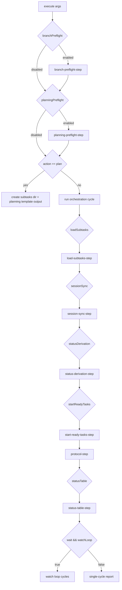

# Atomic Sprint Loop

This document explains the sprint orchestrator control flow and each atomic step.

## Entry Point

- File: `src/sprint/sprint-orchestrator.ts`
- Public method: `execute(args: SprintAgentArgs)`
- Shared args type: `src/sprint/sprint-types.ts`
- Supporting modules:
  - `src/domain/sprint/orchestrator/*`
  - `src/domain/sprint/ci/*`

## Actions

- `plan`
- `status`
- `orchestrate`

## Step Toggle Settings

Controlled by `dashboardSettings.sprintLoopSteps`:

- `branchPreflight`
- `planningPreflight`
- `loadSubtasks`
- `sessionSync`
- `statusDerivation`
- `startReadyTasks`
- `mergeProtocol`
- `actionRequiredProtocol`
- `statusTable`
- `watchLoop`

## Loop Flow Diagram


```mermaid
flowchart TD
  A[execute args] --> B{branchPreflight}
  B -->|enabled| C[branch-preflight-step]
  B -->|disabled| D
  C --> D{planningPreflight}
  D -->|enabled| E[planning-preflight-step]
  D -->|disabled| F
  E --> F{action == plan}
  F -->|yes| G[create subtasks dir + planning template output]
  F -->|no| H[run orchestration cycle]
  H --> I{loadSubtasks}
  I --> J[load-subtasks-step]
  J --> K{sessionSync}
  K --> L[session-sync-step]
  L --> M{statusDerivation}
  M --> N[status-derivation-step]
  N --> O{startReadyTasks}
  O --> P[start-ready-tasks-step]
  P --> Q[protocol-step]
  Q --> R{statusTable}
  R --> S[status-table-step]
  S --> T{wait && watchLoop}
  T -->|true| U[watch loop cycles]
  T -->|false| V[single-cycle report]
```

## Pull Request Content Rules

Automatically created PRs must provide sufficient human context:
- **Worker Feature PRs** (`worker-branch -> sprint-feature-branch`): Must include both the current task description (from the prompt) and the sprint goal/description in the PR body.
- Worker feature PR timing is rendered with the same completion timestamp later persisted to the task run, so PR bodies show `Finished` and `Duration` even though the PR is opened just before task-run finalization.
- **Main Merge PRs** (`sprint-feature-branch -> default-branch`): Must include the sprint description alongside branch and sprint numbering metadata.
- If task or sprint descriptions are missing/empty, PR bodies will use a compact fallback text instead of omitting sections.
- The `default-branch` target is the resolved scoped `git.defaultBranch` value (`system -> project -> sprint` settings). Legacy project metadata cannot override it during sprint completion, so inherited system defaults such as `dev` remain the final merge target.

## Execution Phases

### 1. Branch preflight (optional)
- Step module: `branch-preflight-step.ts`
- Applies to: `plan` and `orchestrate`
- Validates sprint feature branch exists:
  - locally
  - on remote origin
- On failure: returns templated blocker instructions.

### 2. Planning preflight (optional)
- Step module: `planning-preflight-step.ts`
- Applies to: `status` and `orchestrate`
- Ensures subtask markdown files exist in sprint subtask directory.
- On failure: returns templated planning blocker.

### 3. Plan action
If `action=plan`:
- Creates subtask directory if missing.
- Optionally injects `sprint_agent_guide.md`.
- Returns templated planning instructions.
- Planning may apply a provider-suggested sprint title only when the sprint was explicitly stored as generated/auto-named at creation time. Placeholder-looking custom titles such as `Untitled sprint 1` are treated as user titles and are not writable by planning.

### 4. Orchestration cycle
For `status` and `orchestrate`, each cycle can run:

1. Load subtasks
- `load-subtasks-step.ts`

2. Sync sessions and activities
- `session-sync-step.ts`
- Session-sync activity fetch planning is delegated to `src/domain/sprint/session-sync/activity-fetch-plan.ts` to make decisions testable.
- Session state, task-run state, dispatch status, dispatch error message, and planning-status mapping are delegated to `src/domain/sprint/session-sync/session-state-mapping.ts`. This boundary is pure: it contains no repository writes, provider calls, activity reads, or cooldown retry decisions.
- Session activity fetch planning deduplicates by task-run key and normalized session aliases before entering the fetch pool. Foreign task-run matches are skipped with a warning, and locally terminal sessions are skipped only when the provider state is also terminal (`COMPLETED`, `FAILED`, or another state that maps to failed such as `CANCELLED`). A locally terminal session that is remote-running or action-required is still fetched so reruns, submitted replies, quota recovery, and other active-session follow-up can settle correctly.
- Session activity fetching uses a bounded concurrency worker pool to prevent overloading the backend, preserving isolated failures per-session. Activity reads also use a timeout guard, so one slow or failed provider activity lookup degrades that session to an empty activity list without blocking unrelated task sync. Fully synchronized local/remote terminal skips are logged and do not enter the activity fetch pool.
- Each session-sync cycle keeps a cycle-local metadata cache keyed by session object and normalized session id/name. The cache resolves session identity, latest task-run ownership, provider/mode ownership, and local terminal state once per session for that cycle only, so activity planning and task sync share the same safety decisions without repeated dependency or repository lookups.
- Sync source is provider-agnostic:
  - Jules API sessions (when available)
  - locally tracked CLI sessions (`gemini`/`codex`)

3. Derive effective task status
- `status-derivation-step.ts`
- Task transition decisions are centralized in `src/domain/sprint/task-transition-state.ts`.
  The step asks this pure helper whether dependencies are met, whether a failed
  session should reset to `PENDING` or remain `BLOCKED`, and whether terminal,
  QA-pending, merge-required, quota, or failed states should be preserved.

4. Start ready tasks (orchestrate only)
- `start-ready-tasks-step.ts`
- Provider is selected per task using `aiProvider` strategy.
- For CLI providers the workflow is:
  - allocate a unique sprint feature branch name when the sprint has not persisted one yet, checking local and remote refs so restarted sprint numbers do not reuse old branch history
  - create child task branch from sprint feature branch
  - run CLI in background
  - commit/push branch
  - open PR back to sprint feature branch
  - track state and activity in sqlite
- CLI task dispatch carries two task identities through the runtime: the human task key (`T01`, `T02`, ...) stays in branch names, titles, prompts, and task-run tags, while repository/execution lookups use the persisted task record id (`record_id`). Workspace resume targets, task runs, dispatches, and provider invocations must use the record id so normal planned sprint tasks can resume from the correct Docker workspace volume after cancellation or restart.
- Ready-task dispatch is idempotent per `(sprint_run_id, task_id)`. If a watch-loop cycle or recovered monitor sees an existing queued/claimed/running/cancel-requested/paused dispatch for that task in the same run, it reuses the existing runtime row instead of starting a duplicate provider invocation.
- CLI workspace patch export discovers untracked files with Git's `--exclude-standard` filtering, then intent-to-adds only those non-ignored paths in bounded batches before diffing. Ignored workspace caches such as `.pnpm-store`, provider runtime homes, and transient export indexes are export noise and must not turn a completed/no-change provider run into a failed dispatch.

5. Build protocol instructions
- `protocol-step.ts`
 - Action-required tasks are separated into:
   - `AGENT INTERVENTION NEEDED`
   - `HUMAN INTERVENTION NEEDED`

6. Build status table
- `status-table-step.ts`

### Automation intervention routing

Action-required Jules sessions (`AWAITING_PLAN_APPROVAL`, `AWAITING_USER_FEEDBACK`, `PAUSED`) are routed by automation policy:
- `FULL`: auto-intervene for all supported action-required states.
- `SEMI_AUTO`: obey `automationInterventions` toggles.
- `ALWAYS_ASK`: no auto-intervention.
- Worker-generated clarification replies are tracked against the persisted task record id (`record_id`) when available, not the display task key (`T01`, `T02`, ...), so auto-intervention does not fail during execution-invocation logging.
- Worker-generated clarification replies now use the editable `Project manager` agent preset instead of worker instructions, and the prompt includes a dedicated Jules clarification-request section so the latest explicit message is preserved when available.
- Worker-generated clarification replies unwrap CLI provider response envelopes before they are sent back to Jules, even when bootstrap or package-manager output surrounds the JSON envelope.
- Clarification dedupe ignores Code UX's own user reply activity and keys silent Jules prompts by the latest non-user activity id/time, so repeated polling of the same activity is idempotent while a later unanswered Jules activity is treated as a new request.

When auto-intervention fails, tasks are routed to `AGENT INTERVENTION NEEDED` with context.

## Watch Mode

When `action=orchestrate`, `wait` is true, and `watchLoop` is enabled:
- Orchestrator enters continuous loop.
- Wait interval is 10 seconds between cycles.
- Output interval defaults to 300 seconds and is now used only as an internal checkpoint boundary for heartbeat/lease renewal inside the same sprint run.
- Code UX does not stop at that boundary anymore. It keeps the same sprint run alive, renews its lease/heartbeat, resets the checkpoint window, and continues watching until a real terminal condition is reached.
- Startup recovery and dashboard **Resume** restart monitoring through the existing-run recovery path. A resumed paused run keeps its original sprint-run id, is moved back to `running`, and then starts the watch loop without creating a duplicate run. Resume is refused while another queued/running/cancel-pending run for the same sprint is active.
- Existing-run recovery first checks the in-memory active-orchestrator registry and returns without starting another watch loop when the same project/sprint is already being monitored by the current process.
- Sprint-run lifecycle updates are mirrored to the parent sprint row for dashboard/operator consistency. Active run states (`queued`, `running`, `cancel_requested`) keep the sprint `running`; pause, completion, failure, and cancellation transitions update the sprint row to the matching summary state. Heartbeats also repair drift after restarts, so a live run cannot remain hidden behind an `idle` sprint summary.
- Human-escalated merge conflicts stop counting as worker activity. If a task conflict has already been handed to a human and no runnable work remains, the watch loop pauses the sprint instead of keeping the run alive with only heartbeat traffic.
- When a sprint completes or is cancelled, Code UX resolves transient merge attention and merge-derived human handoff items for that run so completed local-git sprints do not remain pinned to intervention by stale conflict rows.
- Sprint cancellation also marks running provider invocations and QA review rows for the sprint run as cancelled, including sprint-level QA invocations that are not attached to an active task dispatch, and stops their Docker sessions when containers are still present.
- Merge attention is not cleared while a task is still in the `CI` stage. This keeps dirty PRs and unresolved CI/merge blockers visible instead of silently heartbeating a sprint with no active dispatches.
- Live CLI telemetry stays enabled during watch mode, including transcript parsing and token accounting. To keep high-concurrency sprints responsive, each provider watcher fingerprints its current stdout/stderr and provider log sources, uses cheap file/source metadata before reading full provider transcripts when available, skips provider-specific read and parse/token work when the sources are unchanged, reuses Codex tokenizer encodings and recent token counts, and only persists provider usage rows when token/transcript state changes.
- Provider telemetry watchers are best-effort and never fail the provider run. Repeated watcher read or parse failures are logged as throttled runtime warnings with provider, Code UX session id, native session id when known, and failure count, without including prompts, transcripts, raw streams, or credentials.
- Dashboard live snapshots are optimized for high sprint concurrency: selected-sprint checks use targeted project/sprint lookups instead of hydrating every sprint, recent provider activities are cached until the project's latest provider activity event changes, and provider activity event reads use partial sqlite indexes for the activity-only paths.
- Preview reconciliation also avoids full project execution snapshots in the common running-session path. It queries running sprint runs directly and memoizes that result while reconciling preview sessions and auto-starting previews.
- Loop exits when:
  - all tasks terminal (`COMPLETED+merged` or `FAILED`) and the final merge is settled: remote-git mode requires GitHub to report the completion PR as merged, while local-git mode requires the sprint feature branch to merge into the configured local default branch, or
  - no runnable tasks remain, or
  - merge-required tasks are detected.
- In local-git mode, the final sprint feature-branch merge runs in a temporary Git worktree and force-updates the configured default branch after the merge succeeds. The visible project checkout is not switched between branches, so user-facing local workspaces stay clean and stay on the branch the operator had checked out.
- The watch loop uses the same `task-transition-state.ts` helper as the cycle
  runner to classify settled tasks, failed terminal tasks, PR-backed merge waits,
  QA-pending tasks, quota waits, dependency blockers, and worker attention waits.
  Protocol text and status table rendering remain separate presentation steps.

On completion it may:
- clean up subtask directory,
- append completion steps,
- preserve files when failures remain.

## Single-Cycle Fallback

If caller requests wait mode but `watchLoop` toggle is disabled:
- orchestrator runs one cycle,
- returns normal report with a note that watch mode is disabled.

For `action=status`:
- orchestration always runs as a single cycle for immediate output,
- `wait: true` is ignored and reported as informational text.

## CI Intelligence Integration

`ciIntelligence` settings affect generated protocol text:
- CI status classification is centralized in `src/sprint/ci-status-utils.ts` via `isCiFailure(status, conclusion)` and `isCiPending(status, conclusion)` so feature and main merge gates evaluate checks with the same rules.
- Feature-branch merge instructions can require CI wait and comment resolution.
- Final merge-to-main instructions can require CI wait and comment resolution.
- When a task finishes provider work but its feature PR is still missing, pending, failing, or review-blocked, the CI gate now persists that task back to in-progress state in project task records so dashboard task lists do not incorrectly show it as finished.
- When a completed CLI task has a recorded worker branch but no PR, the feature PR gate verifies that the branch still exists and has commits ahead of the sprint feature branch. If the branch is missing or has no unmerged commits, Code UX clears the stale worker-branch evidence, settles the task as completed with no merge marker, and avoids opening a permanent `merge_required` attention item for no-op work.
- In `WHEN_GREEN` feature PR mode, a clean PR with no check-rollup entries and no tracked CI runs is treated as CI-skipped after a 10 minute grace window. This prevents feature PRs from heartbeating forever when the repository has PR workflows but no run is ever materialized for that branch.
- When QA requests fixes and Code UX applies them through a same-session CLI follow-up, the next sprint cycle treats the completed `cli_task_followup` invocation as fresh task work and reruns QA verification instead of waiting for a separate task-run completion timestamp.
- Task-completion and completed-without-PR QA use the trigger's ordered `agentPresetIds` list. `[]` means zero custom reviewer IDs plus one built-in/default QA fallback; one ID runs one reviewer; multiple IDs run multiple reviewers in order. Each resolved reviewer creates its own `qa_review_runs` row in the same review cycle with the same `run_index`, for example `agent-qa-security` and `agent-qa-regression` can both review `project-123` task `T02` in run `2`. The cycle passes only when every reviewer passes. Any reviewer that requests changes, fails, or is still running keeps the task blocked under the existing QA gate rules, and reviewer rows remain visible per agent.
- When CLI QA follow-up work creates or reuses a task PR after an earlier PR for the same task was already merged, Code UX clears stale merged state and persists the task as code-complete again so the feature PR gate can evaluate and auto-merge the follow-up PR.
- When a task is parked in `QA_REVIEW_FAILED` but its feature PR is later merged manually, the feature PR gate treats the merged PR as authoritative, marks the task `COMPLETED`/`MERGED`, and lets dependent tasks proceed.
- Repeated watch-loop cycles must be idempotent. Retryable CI observations such as pending checks, pending PR mergeability, and armed auto-merge keep the task in `RUNNING` with the `CI` merge indicator, emit stable task-run event keys, and must not consume another CI-fix retry or redispatch dependent work.
- Dependency unlocks are gated on the dependency's settled pipeline state, not on provider completion alone. A dependent task remains blocked while its dependency is in CI, QA, merge-required, or merge-conflict state, and becomes dispatchable only after the dependency is merged or is confirmed to have no merge work.
- QA is fail-closed. A task whose QA review budget is exhausted under `ESCALATE_TO_HUMAN` is parked in `QA_REVIEW_FAILED`, receives one human-escalation attention item, and repeated cycles do not reopen duplicate attention or let the task merge until a later authoritative merged PR or human action changes the state.
- Recovered stale QA reviews are treated as retryable infrastructure signals even when the verdict budget is otherwise spent. They do not trigger the QA exhaustion policy or human escalation unless a later non-recovered failure reaches the configured ceiling.
- QA review budgets count review cycles, not reviewer rows. Multiple reviewer rows with the same `run_index` spend one task or sprint QA attempt while still preserving reviewer-specific `agent_preset_id`, `agent_name`, payload details, and task-run events for dashboard history. Latest-cycle summaries prefer blocking rows (`running`, `changes_requested`, or `failed`) over passing rows, so a single passing reviewer cannot hide another reviewer that still blocks the cycle.
- Starting or resuming orchestration resolves stale sprint-level `manual_attention` escalations from prior runs. The new run recomputes current blockers, while task-specific human attention remains open until explicitly handled.
- Before task QA gates are evaluated, the sprint cycle reconciles running task QA invocations with provider runtime state. Missing provider linkage or a missing Docker session container makes the stale QA row retryable instead of blocking the task indefinitely at `QA_PENDING`.
- Sprint-completion QA also uses the sprint trigger's `agentPresetIds` list, or one default fallback reviewer when the list is empty. Completion is allowed only after the latest sprint QA cycle has all reviewers passed; any running, failed, or changes-requested reviewer blocks completion and a changes-requested review may route one follow-up task/session repair using the existing sprint QA follow-up logic.
- Sprint orchestration resolves LOCAL vs REMOTE git behavior from the effective project/sprint settings (`settings.git.githubMode`). Local-git projects therefore use the local worker-to-feature merge path consistently during both single-cycle and watch-loop runs.
- Local-git sprint completion performs the final `feature -> default` merge directly in the host repository with no remote host or PR requirement. The watch loop records the user's checked-out ref before the merge, checks out or creates the configured local default branch as needed, merges the sprint feature branch, then restores the original ref in cleanup. Restore failures are logged but do not change the merge result; branch deletion is skipped when restore fails.
- Local-git final merge failures are fail-closed. Missing refs or git setup errors surface as actionable merge feedback, real merge conflicts open or preserve main-merge attention items, and the sprint run is not marked `completed` until a later watch-loop cycle observes a successful local merge.
- In local-git mode, when a task completed without a PR and then receives QA fixes, the QA follow-up process continues by attempting to recover the worker branch from task/task run metadata, open/merged PR metadata, or git branch name matching. If the preserved resume workspace is missing, Code UX prepares/recreates the expected worktree on the recovered branch and continues the QA follow-up run without failing. If no branch can be recovered and no safe workspace can be prepared, the orchestrator fails fast.
- Feature-PR auto-merge mode `WHEN_GREEN` waits for a green gate before attempting the merge.
- Main-branch auto-merge mode `ALWAYS` intentionally bypasses the main CI wait gate and attempts the final `feature -> default` merge as soon as the PR is not conflicted or review-blocked.
- Remote-git sprint completion is fail-closed on the final main merge: Code UX does not mark the sprint run `completed` until GitHub polling reports the completion PR as merged. A successful auto-merge command only keeps the sprint active for another poll; it is not enough to finish the sprint by itself.
- Main-branch auto-merge mode `CREATE_PR` opens or reuses the final completion PR, then pauses for a human handoff until that PR is merged and the sprint is resumed.
- Before creating the final `feature -> default` merge PR, Code UX now verifies that the configured default branch exists on `origin`. If it is missing, Code UX creates it from the repository's actual `origin/HEAD` branch, pushes it, and then creates the final PR against the configured target.
- Main-branch PR creation failures are logged and surfaced in the final merge gate feedback instead of being reduced to an unexplained missing-PR wait state.
- When the watch loop waits or exits at the final main-merge gate, the dashboard status snapshot is republished with the finalization report so operators can see the current blocker without waiting for a later cycle.
- If feature PR checks fail, the sprint loop keeps the task in work state and enters the CI-fix guardrail path. When `waitForJulesCiAutofix` is enabled for a Jules-managed task, Code UX first notifies the Jules session with failed-check context, matched failed run ids/URLs, failed job names, and failed-job log excerpts (when available). When that toggle is disabled, or the task is not Jules-managed, Code UX skips the Jules notification and dispatches a worker-owned `ci_fix_required` item.
- CI autofix retries are capped by `julesCiAutofixMaxRetries`; once exhausted, the task is escalated as intervention-needed with exact task id, PR URL, failed check names, failed run summary, and failed job names (focus: fix CI before merge). The cap applies to the generic CI-fix loop, including worker repairs.
- Worker-owned CI autofix attempts are de-duplicated across watch-loop cycles. While a matching `ci_fix_required` attention item is still open or claimed, Code UX treats that attempt as in-flight, keeps the task in `RUNNING`, and does not consume another retry until the worker attempt resolves. This includes the final main-merge gate: after a worker pushes a CI fix and GitHub reports replacement checks as pending, the main-merge `ci_fix_required` item stays active until checks pass, the merge completes, or another blocker replaces it.
- Human/agent intervention is opened only after the CI-fix guardrail is exhausted; disabling the Jules notification toggle must not disable worker CI repair.

Focused regression commands for these guarantees:

```bash
pnpm run test:backend -- tests/backend/domain/sprint/orchestrator/cycle-state-coordinator.test.ts tests/backend/domain/sprint/orchestrator/cycle-runner.test.ts tests/backend/domain/sprint/ci/feature-pr-gate.test.ts tests/backend/sprint/watch-loop-core.test.ts
pnpm run test:backend
pnpm run lint
```

## Files and Data Used

- Subtasks directory:
  - `.jules-subagents/sprints/sprint<N>-subtasks/`
- Guide files:
  - `.jules-subagents/agents/*.md`
- Instruction templates:
  - `.jules-subagents/instructions/sprint-main-loop/**/*`
- CLI session tracking DB:
  - `~/.jules-subagents/session-tracking.db`

## Operational Advice

- Keep branch and planning preflight enabled in production.
- Disable individual steps only for diagnostics or controlled experiments.
- Treat instruction templates as runtime policy text, not source logic.
