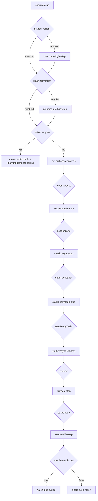

# Atomic Sprint Loop

This document explains the sprint orchestrator control flow and each atomic step.

## Entry Point

- File: `src/sprint/sprint-orchestrator.ts`
- Public method: `execute(args: SprintAgentArgs)`
- Shared args type: `src/sprint/sprint-types.ts`
- Current orchestration split modules:
  - `src/domain/sprint/orchestrator/sprint-orchestrator.ts`
  - `src/domain/sprint/orchestrator/sprint-action-runner.ts`
  - `src/domain/sprint/orchestrator/cycle-runner.ts`
  - `src/domain/sprint/orchestrator/watch-loop-runner.ts`
  - `src/domain/sprint/orchestrator/watch-loop-state-machine.ts`
  - `src/domain/sprint/orchestrator/cycle-state-coordinator.ts`
  - `src/domain/sprint/ci/feature-pr-gate.ts`
  - `src/sprint/steps/*`

## Actions

- `plan`
- `status`
- `orchestrate`

## Step Toggle Settings

Controlled by `dashboardSettings.sprintLoopSteps`:

- `branchPreflight`
- `planningPreflight`
- `loadSubtasks`
- `sessionSync`
- `statusDerivation`
- `startReadyTasks`
- `protocol`
- `statusTable`
- `watchLoop`

## Loop Flow Diagram


```mermaid
flowchart TD
  A[execute args] --> B{branchPreflight}
  B -->|enabled| C[branch-preflight-step]
  B -->|disabled| D
  C --> D{planningPreflight}
  D -->|enabled| E[planning-preflight-step]
  D -->|disabled| F
  E --> F{action == plan}
  F -->|yes| G[create subtasks dir + planning template output]
  F -->|no| H[run orchestration cycle]
  H --> I{loadSubtasks}
  I --> J[load-subtasks-step]
  J --> K{sessionSync}
  K --> L[session-sync-step]
  L --> M{statusDerivation}
  M --> N[status-derivation-step]
  N --> O{startReadyTasks}
  O --> P[start-ready-tasks-step]
  P --> Q{protocol}
  Q --> R[protocol-step]
  R --> S{statusTable}
  S --> T[status-table-step]
  T --> U{wait && watchLoop}
  U -->|true| V[watch loop cycles]
  U -->|false| W[single-cycle report]
```

## Pull Request Content Rules

Automatically created PRs must provide sufficient human context:
- **Worker Feature PRs** (`worker-branch -> sprint-feature-branch`): Must include both the current task description (from the prompt) and the sprint goal/description in the PR body.
- Worker feature PR timing is rendered with the same completion timestamp later persisted to the task run, so PR bodies show `Finished` and `Duration` even though the PR is opened just before task-run finalization.
- **Main Merge PRs** (`sprint-feature-branch -> default-branch`): Must include the sprint description alongside branch and sprint numbering metadata.
- Main merge PR timing uses the sprint run's persisted `startedAt` plus the finalization timestamp captured at PR creation time until the sprint run completion row is persisted. Once `finishedAt` exists on the sprint run, that stored value remains authoritative for historical PR rendering.
- If task or sprint descriptions are missing/empty, PR bodies will use a compact fallback text instead of omitting sections.
- The `default-branch` target is the resolved scoped `git.defaultBranch` value (`system -> project -> sprint` settings). Legacy project metadata cannot override it during sprint completion or branch preflight, so inherited system defaults such as `dev` remain the final merge target.

## Execution Phases

### 1. Branch preflight (optional)
- Step module: `branch-preflight-step.ts`
- Applies to: `plan` and `orchestrate`
- Validates that the sprint feature branch exists locally and on the remote origin (`LOCAL` vs `REMOTE` git behavior applies). During orchestration, it will create and check out the missing feature branch from the default branch, and push it to the remote.
- Records the base commit SHA when a branch is freshly created.
- On failure: returns templated blocker instructions.

### 2. Planning preflight (optional)
- Step module: `planning-preflight-step.ts`
- Applies to: `status` and `orchestrate`
- Verifies that the sprint subtask directory exists and contains at least one `.md` file.
- On failure: returns templated planning blocker.

### 3. Plan action
If `action=plan`:
- Creates subtask directory if missing under `.code-ux/sprints/**`.
- Uses DB-backed planning to generate or regenerate subtasks, writing the resulting sprint subtask markdown artifacts to `.code-ux/sprints/**`.
- Optionally injects `sprint_agent_guide.md`.
- Returns templated planning instructions.
- Planning may apply a provider-suggested sprint title only when the sprint was explicitly stored as generated/auto-named at creation time. Placeholder-looking custom titles such as `Untitled sprint 1` are treated as user titles and are not writable by planning.
- Planning self-reflection is available under `agents.selfReflection.planning` and defaults to `enabled: false`. When enabled, the planning provider rates its parsed JSON output against configured `{ id, label, prompt, threshold }` criteria using JSON-only 1-10 scores. Below-threshold ratings can trigger same-session improvement prompts up to `maxImprovementAttempts`, but every improved plan is parsed through the existing planning JSON extractor and `PlanningPayloadValidator`, so DAG order, task keys, dependency references, and required prompt sections remain mandatory.
- Planning reflection is optional and fail-open. Malformed reflection JSON, provider failures, or invalid improved planning JSON are logged and leave the last valid parsed plan in place rather than bypassing validation or corrupting the accepted output.
- Planning reflection gates planning autostart when it is enabled. A request with `autoStart: true` starts orchestration only after the final planning reflection decision passes; if reflection fails, reaches the improvement-attempt limit without passing, or cannot parse an improvement, Code UX persists the valid planned tasks and leaves the sprint planned but not running.
- Operators can manually start a planned sprint after reviewing or editing the tasks when planning reflection does not pass. When planning reflection is disabled, `autoStart: true` keeps the existing behavior and starts immediately after valid tasks are persisted.
- Reflection audit records are appended to the planning execution invocation as message metadata. The metadata stores criteria, thresholds, scores, pass/fail state, attempt count, and final decision; it does not duplicate provider credentials.

### 4. Orchestration cycle
For `status` and `orchestrate`, each cycle follows the strict execution order defined in `CycleRunner.run`:

1. **Load subtasks**: Reads subtask markdown files via `SprintExecutionStateService` and reconciles them with the current DB task and task_run execution state.
2. **Snapshot entry states**: Captures task statuses at the start of the cycle.
3. **Sync sessions**: Synchronizes hosted provider sessions and local/CLI/worker dispatch state through execution records and provider invocations. Sync source is provider-agnostic.
4. **Derive effective task status**: Applies pre-CI status normalization rules. For example, a `COMPLETED` task with unmerged PR evidence is moved back to `CODING_COMPLETED`, and settled merge evidence officially marks a task as `COMPLETED`. Intervention and merge indicators are also refreshed.
5. **Start ready tasks** (`orchestrate` only):
   - Filters `PENDING` tasks, skips quota cooldowns, applies coding guardrails, and respects provider concurrency deferrals.
   - Evaluates the readiness gate: a task must be `PENDING`, dependencies completed and merged, provider concurrency available, and emergency stop inactive.
   - Task dispatch creates DB task dispatch and task-run records, selects the provider based on settings (uses hosted provider for `jules` and CLI/Docker or host workflows for local providers).
   - Marks tasks `RUNNING`, records session id/name/provider, and resets consecutive failure count on success. Triggers emergency stop after repeated real dispatch failures.
6. **Apply protocol step**:
   - Provider-agnostic handling of plan approval, clarification replies (via Project manager preset), and paused sessions, utilizing cooldown/dedupe rules and escalating attention items when necessary.
   - Gathers CI data for feature branches.
   - Ensures PRs are tracked accurately.
   - Evaluates completed coding work (`CODING_COMPLETED`). QA is a formal part of the merge gate, evaluating the work rather than acting as a vague final-only review. This handles retry/review behavior, stale QA invocation reconciliation, QA follow-up reruns, and transitions tasks back to in-progress when PR/CI/QA is not merge-ready.
   - Evaluates completed coding work for PR/CI/merge readiness, review blockers, merge conflicts, missing PRs, and attention items. Does not automatically merge or apply fixes unless tied to configured auto-merge modes and intelligence settings.
   - Saves the result of the CI merge gates.
   - Re-evaluates state and starts ready tasks if merges unblocked dependencies.

7. **Build status table output**:
   - Compiles the final cycle report and separates action-required tasks into agent and human intervention categories.

## Watch Mode

When `action=orchestrate`, `wait` is true, and `watchLoop` is enabled:
- Orchestrator executes continuous cycles.
- Wait interval is 10 seconds between cycles.
- Checkpoint reports (based on `watchLoopOutputIntervalSeconds`) are emitted without ending the run. The checkpoint boundary is used to renew heartbeats and leases inside the same sprint run, keeping it alive while resetting the checkpoint window.
- The loop continuously observes pause and cancel interventions at the top of each cycle.
- Finalisation only runs on terminal conditions.
- Startup recovery and dashboard **Resume** restart monitoring through the existing-run recovery path. A resumed paused run keeps its original sprint-run id, is moved back to `running`, and then starts the watch loop without creating a duplicate run. Resume is refused while another queued/running/cancel-pending run for the same sprint is active.
- Existing-run recovery first checks the in-memory active-orchestrator registry and returns without starting another watch loop when the same project/sprint is already being monitored by the current process.
- Sprint-run lifecycle updates are mirrored to the parent sprint row for dashboard/operator consistency. Active run states (`queued`, `running`, `cancel_requested`) keep the sprint `running`; pause, completion, failure, and cancellation transitions update the sprint row to the matching summary state. Heartbeats also repair drift after restarts, so a live run cannot remain hidden behind an `idle` sprint summary.
- Human-escalated merge conflicts stop counting as worker activity. If a task conflict has already been handed to a human and no runnable work remains, the watch loop pauses the sprint instead of keeping the run alive with only heartbeat traffic.
- When a sprint completes or is cancelled, Code UX resolves transient merge attention and merge-derived human handoff items for that run so completed local-git sprints do not remain pinned to intervention by stale conflict rows.
- Sprint cancellation also marks running provider invocations and QA review rows for the sprint run as cancelled, including sprint-level QA invocations that are not attached to an active task dispatch, and stops their Docker sessions when containers are still present.
- Merge attention is not cleared while a task is still in the `CI` stage. This keeps dirty PRs and unresolved CI/merge blockers visible instead of silently heartbeating a sprint with no active dispatches.
- Live CLI telemetry stays enabled during watch mode, including transcript parsing and token accounting. To keep high-concurrency sprints responsive, each provider watcher fingerprints its current stdout/stderr and provider log sources, uses cheap file/source metadata before reading full provider transcripts when available, skips provider-specific read and parse/token work when the sources are unchanged, reuses Codex tokenizer encodings and recent token counts, and only persists provider usage rows when token/transcript state changes.
- Provider telemetry watchers are best-effort and never fail the provider run. Repeated watcher read or parse failures are logged as throttled runtime warnings with provider, Code UX session id, native session id when known, and failure count, without including prompts, transcripts, raw streams, or credentials.
- Dashboard live snapshots are optimized for high sprint concurrency: selected-sprint checks use targeted project/sprint lookups instead of hydrating every sprint, recent provider activities are cached until the project's latest provider activity event changes, and provider activity event reads use partial sqlite indexes for the activity-only paths.
- Preview reconciliation also avoids full project execution snapshots in the common running-session path. It queries running sprint runs directly and memoizes that result while reconciling preview sessions and auto-starting previews.
- Loop exits when:
  - all tasks reach their terminal state (e.g., `COMPLETED` + merged, or `FAILED`) and the final merge is settled: remote-git mode requires GitHub to report the completion PR as merged, while local-git mode requires the sprint feature branch to merge into the configured local default branch, or
  - no runnable tasks remain, or
  - merge-required tasks are detected that need manual intervention.
- The checkpoint window triggers internal reports and lease renewals without stopping the run. The run pauses for human handoff (such as `CREATE_PR` mode for main-branch merges) or cancels if aborted.
- In local-git mode, the final sprint feature-branch merge runs in a temporary Git worktree and force-updates the configured default branch after the merge succeeds. The visible project checkout is not switched between branches, so user-facing local workspaces stay clean and stay on the branch the operator had checked out.
- The watch loop uses the same `task-transition-state.ts` helper as the cycle
  runner to classify settled tasks, failed terminal tasks, PR-backed merge waits,
  QA-pending tasks, quota waits, dependency blockers, and worker attention waits.
  Protocol text and status table rendering remain separate presentation steps.

On completion or pause, Code UX performs finalization cleanup where the source supports it. It triggers memory auto-promotion, removes orphaned Docker worktrees from terminal CLI dispatches, and clears temporary workspaces, but it never blindly deletes execution artifacts if failures or active blocks remain.

## Single-Cycle Fallback

If caller requests wait mode but `watchLoop` toggle is disabled:
- orchestrator runs one cycle,
- returns normal report with a note that watch mode is disabled.

For `action=status`:
- orchestration always runs as a single cycle for immediate output,
- `wait: true` is ignored and reported as informational text.

## CI Intelligence Integration

`ciIntelligence` settings affect generated protocol text:
- CI status classification is centralized in `src/sprint/ci-status-utils.ts` via `isCiFailure(status, conclusion)` and `isCiPending(status, conclusion)` so feature and main merge gates evaluate checks with the same rules.
- Feature-branch merge instructions can require CI wait and comment resolution.
- Final merge-to-main instructions can require CI wait and comment resolution.
- When a task finishes provider work but its feature PR is still missing, pending, failing, or review-blocked, the CI gate now persists that task back to in-progress state in project task records so dashboard task lists do not incorrectly show it as finished.
- When a completed CLI task has a recorded worker branch but no PR, the feature PR gate verifies that the branch still exists and has commits ahead of the sprint feature branch. If the branch is missing or has no unmerged commits, Code UX clears the stale worker-branch evidence, settles the task as completed with no merge marker, and avoids opening a permanent `merge_required` attention item for no-op work.
- In `WHEN_GREEN` feature PR mode, a clean PR with no check-rollup entries and no tracked CI runs is treated as CI-skipped after a 10 minute grace window. This prevents feature PRs from heartbeating forever when the repository has PR workflows but no run is ever materialized for that branch.
- When QA requests fixes and Code UX applies them through a same-session CLI follow-up, the next sprint cycle treats the completed `cli_task_followup` invocation as fresh task work and reruns QA verification instead of waiting for a separate task-run completion timestamp. If a restart happens before that invocation marker is persisted, the cycle can also use a later completed task run for the task's current session as recovery evidence, preventing a completed fix attempt from staying parked at `CODING_COMPLETED`/`QA_PENDING` forever.
- Task-completion and completed-without-PR QA use the trigger's ordered `agentPresetIds` list. `[]` means zero custom reviewer IDs plus one built-in/default QA fallback; one ID runs one reviewer; multiple IDs run multiple reviewers in order. Each resolved reviewer creates its own `qa_review_runs` row in the same review cycle with the same `run_index`, for example `agent-qa-security` and `agent-qa-regression` can both review `project-123` task `T02` in run `2`. The cycle passes only when every reviewer passes. Any reviewer that requests changes, fails, or is still running keeps the task blocked under the existing QA gate rules, and reviewer rows remain visible per agent.
- QA self-reflection is available under `agents.selfReflection.qualityAssurance` and also defaults to disabled. When enabled, QA results follow the same rate-and-improve loop as planning, and any improved QA output must pass the normal normalized QA schema before it can replace the previous valid result.
- When CLI QA follow-up work creates or reuses a task PR after an earlier PR for the same task was already merged, Code UX clears stale merged state and persists the task as code-complete again so the feature PR gate can evaluate and auto-merge the follow-up PR.
- When a task is parked in `QA_REVIEW_FAILED` but its feature PR is later merged manually, the feature PR gate treats the merged PR as authoritative, marks the task `COMPLETED`/`MERGED`, and lets dependent tasks proceed.
- Repeated watch-loop cycles must be idempotent. Retryable CI observations such as pending checks, pending PR mergeability, and armed auto-merge keep the task in `RUNNING` with the `CI` merge indicator, emit stable task-run event keys, and must not consume another CI-fix retry or redispatch dependent work.
- Dependency unlocks are gated on the dependency's settled pipeline state, not on provider completion alone. A dependent task remains blocked while its dependency is in CI, QA, merge-required, or merge-conflict state, and becomes dispatchable only after the dependency is merged or is confirmed to have no merge work (e.g. completed task with no recorded worker branch or PR URL).
- QA is fail-closed. A task whose QA review budget is exhausted under `ESCALATE_TO_HUMAN` is parked in `QA_REVIEW_FAILED`, receives one human-escalation attention item, and repeated cycles do not reopen duplicate attention or let the task merge until a later authoritative merged PR or human action changes the state.
- Recovered stale QA reviews are treated as retryable infrastructure signals even when the verdict budget is otherwise spent. They do not trigger the QA exhaustion policy or human escalation unless a later non-recovered failure reaches the configured ceiling.
- QA review budgets count review cycles, not reviewer rows. Multiple reviewer rows with the same `run_index` spend one task or sprint QA attempt while still preserving reviewer-specific `agent_preset_id`, `agent_name`, payload details, and task-run events for dashboard history. Latest-cycle summaries prefer blocking rows (`running`, `changes_requested`, or `failed`) over passing rows, so a single passing reviewer cannot hide another reviewer that still blocks the cycle.
- Starting or resuming orchestration resolves stale sprint-level `manual_attention` escalations from prior runs. The new run recomputes current blockers, while task-specific human attention remains open until explicitly handled.
- Before task QA gates are evaluated, the sprint cycle reconciles running task QA invocations with provider runtime state. Missing provider linkage or a missing Docker session container makes the stale QA row retryable instead of blocking the task indefinitely at `QA_PENDING`.
- Sprint-completion QA also uses the sprint trigger's `agentPresetIds` list, or one default fallback reviewer when the list is empty. Completion is allowed only after the latest sprint QA cycle has all reviewers passed; any running, failed, or changes-requested reviewer blocks completion and a changes-requested review may route one follow-up task/session repair using the existing sprint QA follow-up logic.
- Sprint orchestration resolves LOCAL vs REMOTE git behavior from the effective project/sprint settings (`settings.git.githubMode`). Local-git projects therefore use the local worker-to-feature merge path consistently during both single-cycle and watch-loop runs.
- Project-scoped sprint runs ignore stale container-style `repo_path` overrides such as `/workspace` during host-side orchestration, so LOCAL-mode final merges and branch checks use the registered project checkout path.
- Local-git sprint completion performs the final `feature -> default` merge directly in the host repository with no remote host or PR requirement. The watch loop uses a detached temporary worktree for the final merge so the user's visible checkout and uncommitted files are not disturbed. If the configured local default branch is missing, Code UX creates it from the matching remote/default fallback when available, otherwise from the sprint feature branch.
- Local-git final merge failures are fail-closed. Missing refs or git setup errors surface as actionable merge feedback, real merge conflicts open or preserve main-merge attention items, and the sprint run is not marked `completed` until a later watch-loop cycle observes a successful local merge.
- In local-git mode, when a task completed without a PR and then receives QA fixes, the QA follow-up process continues by attempting to recover the worker branch from task/task run metadata, open/merged PR metadata, or git branch name matching. If the preserved resume workspace is missing, Code UX prepares/recreates the expected worktree on the recovered branch and continues the QA follow-up run without failing. If no branch can be recovered and no safe workspace can be prepared, the orchestrator fails fast.
- Feature-PR auto-merge mode `WHEN_GREEN` waits for a green gate before attempting the merge.
- Main-branch auto-merge mode `ALWAYS` intentionally bypasses the main CI wait gate and attempts the final `feature -> default` merge as soon as the PR is not conflicted or review-blocked.
- Remote-git sprint completion is fail-closed on the final main merge: Code UX does not mark the sprint run `completed` until GitHub polling reports the completion PR as merged. A successful auto-merge command only keeps the sprint active for another poll; it is not enough to finish the sprint by itself.
- Main-branch auto-merge mode `CREATE_PR` opens or reuses the final completion PR, then pauses for a human handoff until that PR is merged and the sprint is resumed.
- Before creating the final `feature -> default` merge PR, Code UX now verifies that the configured default branch exists on `origin`. If it is missing, Code UX creates it from the repository's actual `origin/HEAD` branch, pushes it, and then creates the final PR against the configured target.
- In LOCAL mode, before the final `feature -> default` merge, Code UX verifies that the configured target branch exists locally. If it is missing, Code UX creates it from the project's stored default branch, then from `main`/`master` as fallback start points, before attempting the local merge or virtual conflict repair.
- Main-branch PR creation failures are logged and surfaced in the final merge gate feedback instead of being reduced to an unexplained missing-PR wait state.
- When the watch loop waits or exits at the final main-merge gate, the dashboard status snapshot is republished with the finalization report so operators can see the current blocker without waiting for a later cycle.
- If feature PR checks fail, the sprint loop keeps the task in work state and enters the CI-fix guardrail path. When `waitForJulesCiAutofix` (the legacy-named configuration for CI autofix) is enabled for a hosted-provider-managed task, Code UX first notifies the hosted provider session with failed-check context, matched failed run ids/URLs, failed job names, and failed-job log excerpts (when available). When that toggle is disabled, or the task is not hosted-provider-managed, Code UX skips the hosted provider notification and dispatches a worker-owned `ci_fix_required` item.
- CI autofix retries are capped by `julesCiAutofixMaxRetries` (the legacy-named setting); once exhausted, the task is escalated as intervention-needed with exact task id, PR URL, failed check names, failed run summary, and failed job names (focus: fix CI before merge). The cap applies to the generic CI-fix loop, including worker repairs.
- Worker-owned CI autofix attempts are de-duplicated across watch-loop cycles. While a matching `ci_fix_required` attention item is still open or claimed, Code UX treats that attempt as in-flight, keeps the task in `RUNNING`, and does not consume another retry until the worker attempt resolves. This includes the final main-merge gate: after a worker pushes a CI fix and GitHub reports replacement checks as pending, the main-merge `ci_fix_required` item stays active until checks pass, the merge completes, or another blocker replaces it.
- Human/agent intervention is opened only after the CI-fix guardrail is exhausted; disabling the hosted provider notification toggle must not disable worker CI repair.

Focused regression commands for these guarantees:

```bash
pnpm run test:backend -- tests/backend/domain/sprint/orchestrator/cycle-state-coordinator.test.ts tests/backend/domain/sprint/orchestrator/cycle-runner.test.ts tests/backend/domain/sprint/ci/feature-pr-gate.test.ts tests/backend/sprint/watch-loop-core.test.ts
pnpm run test:backend
pnpm run lint
```

## Files and Data Used

- Subtasks directory:
  - `.code-ux/sprints/sprint<N>-subtasks/`
- Guide files:
  - `.code-ux/agents/*.md`
- Instruction templates:
  - `.code-ux/instructions/sprint-main-loop/**/*`
- Legacy CLI session tracking DB:
  - `~/.code-ux/session-tracking.db`
- Preview and startup scripts (only where supported by `sprint-preview-service`).
- Session and task runtime state is persisted in the Code UX SQLite database (`~/.code-ux/app.db`), not a local user directory tracking file.

## Operational Advice

- Keep branch and planning preflight enabled in production.
- Disable individual steps only for diagnostics or controlled experiments.
- Treat instruction templates as runtime policy text, not source logic.
